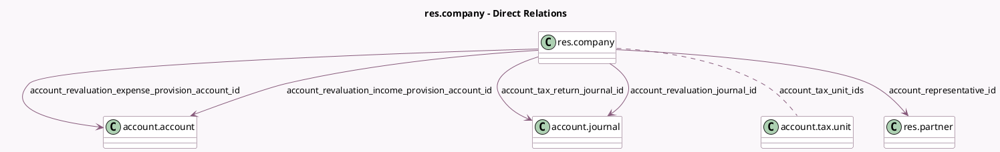

<!-- GENERATED:MODEL -->
---
tags: [odoo, enterprise, generated, model]
---

# res.company

- Module: [[docs/Enterprise Addons/account_reports/account_reports|account_reports]]
- Scope: Enterprise Addons
- Defined in module: extension only
- Source files: `models/res_company.py`
- Python classes: `ResCompany`

## Field footprint

- Detected fields: 11
- Field types: `Boolean` x 2, `Datetime` x 1, `Integer` x 1, `Many2many` x 1, `Many2one` x 5, `Selection` x 1
- Relation fields: 6

## Sample fields

- `account_display_representative_field`: `Boolean` (compute `_compute_account_display_representative_field`)
- `account_last_return_cron_refresh`: `Datetime`
- `account_representative_id`: `Many2one` (comodel `res.partner`)
- `account_return_periodicity`: `Selection`
- `account_return_reminder_day`: `Integer`
- `account_revaluation_expense_provision_account_id`: `Many2one` (comodel `account.account`)
- `account_revaluation_income_provision_account_id`: `Many2one` (comodel `account.account`)
- `account_revaluation_journal_id`: `Many2one` (comodel `account.journal`)
- `account_tax_return_journal_id`: `Many2one` (comodel `account.journal`)
- `account_tax_unit_ids`: `Many2many` (comodel `account.tax.unit`)
- `totals_below_sections`: `Boolean` (compute `_compute_totals_below_sections`, store `True`)

## Method hints

- Detected methods: 9
- Action methods: none
- Compute methods: `_compute_account_display_representative_field`, `_compute_totals_below_sections`
- Onchange methods: none

## Direct relation diagram

## Navigation

- **Parent:** [[docs/Enterprise Addons/account_reports/Models]]

<!-- GENERATED:MODEL -->
