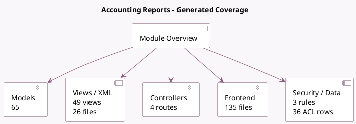

<!-- GENERATED:MODULE -->
---
tags: [odoo, enterprise, module]
---

# Accounting Reports

- Scope: Enterprise Addons
- Source: enterprise/account_reports
- Dependencies: [[docs/Enterprise Addons/account_accountant/account_accountant|account_accountant]]

## Summary

View and create reports

## Generated coverage

- Models: 65
- XML files with UI/data artifacts: 26
- Views: 49
- Actions: 36
- Menus: 27
- Rules (ir.rule): 3
- Access CSV entries: 36
- Controller units: 2
- Frontend asset files: 135

## Module map

## Detail notes

- Models: [[docs/Enterprise Addons/account_reports/Models|Models]] (65)
- Views and XML: [[docs/Enterprise Addons/account_reports/Views|Views]] (26 files)
- Controllers: [[docs/Enterprise Addons/account_reports/Controllers|Controllers]] (2)
- Frontend: [[docs/Enterprise Addons/account_reports/Frontend|Frontend]] (135 files)

## Key models

- `account.account`
- `account.aged.partner.balance.report.handler`
- `account.aged.payable.report.handler`
- `account.aged.receivable.report.handler`
- `account.audit.account.status`
- `account.balance.sheet.report.handler`
- `account.bank.reconciliation.report.handler`
- `account.cash.flow.report.handler`
- `account.change.lock.date`
- `account.customer.statement.report.handler`
- `account.deferred.expense.report.handler`
- `account.deferred.report.handler`

## Navigation

- [[../Enterprise Addons/Enterprise Addons|Back to scope]]
- [[../../docs/docs|Back to docs]]

<!-- GENERATED:MODULE -->

## Curated analysis

### Functional role
- `account_reports` is the enterprise reporting engine for accounting: financial statements, tax returns, budgets, audit checks, exports, and scheduled distribution all live here.
- The same addon also carries the workflow layer around return creation, submission, and review, so it sits between analytics and statutory compliance.

### Operational footprint
- `account_report.py` and `account_return.py` define the core report and return abstractions; wizard files handle sending, export, multicurrency revaluation, and fiscal-year actions.
- The module auto-installs with `account_accountant`, ships cron jobs for report delivery, and loads a broad catalog of XML report definitions.

### Evidence
- Source files: `enterprise/account_reports/models/account_report.py`, `enterprise/account_reports/models/account_return.py`, `enterprise/account_reports/models/budget.py`
- Report definitions and automation: `enterprise/account_reports/data/balance_sheet.xml`, `enterprise/account_reports/data/account_return_data.xml`, `enterprise/account_reports/data/report_send_cron.xml`
- Tests: `enterprise/account_reports/tests/test_account_reports_filters.py`, `enterprise/account_reports/tests/test_account_reports_journal_filter.py`, `enterprise/account_reports/tests/test_account_reports_annotations_export.py`

### Related notes
- `[[docs/Enterprise Addons/account_asset/account_asset|account_asset]]`
- `[[docs/Core/Infrastructure/Reports]]`

### Rollout and migration concerns
- Multi-company and branch setups need extra validation because journal filters, groupings, and return definitions can change what users think they are exporting.
- Return templates and scheduled deliveries should be reviewed as part of the activation checklist, not after go-live, because they affect compliance and stakeholder communication immediately.
- Legacy comparison backlog was retired on 2026-03-02; keep this note focused on the current codebase.

