<!-- GENERATED:MODEL -->
---
tags: [odoo, enterprise, generated, model]
---

# account.batch.payment

- Module: [[docs/Enterprise Addons/account_sepa_direct_debit/account_sepa_direct_debit|account_sepa_direct_debit]]
- Scope: Enterprise Addons
- Defined in module: extension only
- Source files: `models/account_batch_payment.py`
- Python classes: `AccountBatchPayment`

## Field footprint

- Detected fields: 5
- Field types: `Boolean` x 1, `Date` x 2, `One2many` x 1, `Selection` x 1
- Relation fields: 1

## Sample fields

- `sdd_batch_booking`: `Boolean`
- `sdd_first_time_payment_ids`: `One2many` (comodel `account.payment`, compute `_compute_sdd_first_time_payment_ids`)
- `sdd_min_required_collection_date`: `Date` (compute `_compute_sdd_min_required_collection_date`)
- `sdd_required_collection_date`: `Date` (compute `_compute_sdd_required_collection_date`, store `True`)
- `sdd_scheme`: `Selection` (compute `_compute_sdd_scheme`, store `True`)

## Method hints

- Detected methods: 14
- Action methods: none
- Compute methods: `_compute_payment_ids_domain`, `_compute_sdd_first_time_payment_ids`, `_compute_sdd_min_required_collection_date`, `_compute_sdd_required_collection_date`, `_compute_sdd_scheme`
- Onchange methods: none

## Direct relation diagram

```plantuml
@startuml
!define ODOO_COLOR_PRIMARY #714B67
!define ODOO_COLOR_ACCENT #875A7B
!define ODOO_COLOR_BG #FAF7FA

skinparam backgroundColor ODOO_COLOR_BG
skinparam defaultTextAlignment left
skinparam ArrowColor ODOO_COLOR_ACCENT
skinparam ClassBackgroundColor white
skinparam ClassBorderColor ODOO_COLOR_PRIMARY
skinparam ComponentBackgroundColor white
skinparam ComponentBorderColor ODOO_COLOR_PRIMARY
skinparam NoteBackgroundColor #FFF8FF
skinparam NoteBorderColor ODOO_COLOR_ACCENT
skinparam SequenceLifeLineBorderColor ODOO_COLOR_ACCENT
skinparam SequenceLifeLineBackgroundColor #FFFFFF
skinparam SequenceParticipantBorderColor ODOO_COLOR_PRIMARY
skinparam SequenceParticipantBackgroundColor #FFFFFF
skinparam sequence {
  ArrowColor ODOO_COLOR_ACCENT
  ActorBorderColor ODOO_COLOR_PRIMARY
}
title account.batch.payment - Direct Relations
class "account.batch.payment" as account_batch_payment
class "account.payment" as account_payment
account_batch_payment --|> account_payment : sdd_first_time_payment_ids
@enduml
```

## Navigation

- **Parent:** [[docs/Enterprise Addons/account_sepa_direct_debit/Models]]

<!-- GENERATED:MODEL -->
