<!-- GENERATED:MODEL -->
---
tags: [odoo, enterprise, generated, model]
---

# account.payment

- Module: [[docs/Enterprise Addons/account_sepa_direct_debit/account_sepa_direct_debit|account_sepa_direct_debit]]
- Scope: Enterprise Addons
- Defined in module: extension only
- Source files: `models/account_payment.py`
- Python classes: `AccountPayment`

## Field footprint

- Detected fields: 3
- Field types: `Boolean` x 1, `Many2one` x 1, `Selection` x 1
- Relation fields: 1

## Sample fields

- `sdd_mandate_id`: `Many2one` (comodel `sdd.mandate`, compute `_compute_sdd_mandate_id`, store `True`)
- `sdd_mandate_scheme`: `Selection` (related `sdd_mandate_id.sdd_scheme`)
- `sdd_mandate_usable`: `Boolean` (compute `_compute_usable_mandate`)

## Method hints

- Detected methods: 13
- Action methods: none
- Compute methods: `_compute_sdd_mandate_id`, `_compute_usable_mandate`
- Onchange methods: `_onchange_partner_id`

## Direct relation diagram

```plantuml
@startuml
!define ODOO_COLOR_PRIMARY #714B67
!define ODOO_COLOR_ACCENT #875A7B
!define ODOO_COLOR_BG #FAF7FA

skinparam backgroundColor ODOO_COLOR_BG
skinparam defaultTextAlignment left
skinparam ArrowColor ODOO_COLOR_ACCENT
skinparam ClassBackgroundColor white
skinparam ClassBorderColor ODOO_COLOR_PRIMARY
skinparam ComponentBackgroundColor white
skinparam ComponentBorderColor ODOO_COLOR_PRIMARY
skinparam NoteBackgroundColor #FFF8FF
skinparam NoteBorderColor ODOO_COLOR_ACCENT
skinparam SequenceLifeLineBorderColor ODOO_COLOR_ACCENT
skinparam SequenceLifeLineBackgroundColor #FFFFFF
skinparam SequenceParticipantBorderColor ODOO_COLOR_PRIMARY
skinparam SequenceParticipantBackgroundColor #FFFFFF
skinparam sequence {
  ArrowColor ODOO_COLOR_ACCENT
  ActorBorderColor ODOO_COLOR_PRIMARY
}
title account.payment - Direct Relations
class "account.payment" as account_payment
class "sdd.mandate" as sdd_mandate
account_payment --> sdd_mandate : sdd_mandate_id
@enduml
```

## Navigation

- **Parent:** [[docs/Enterprise Addons/account_sepa_direct_debit/Models]]

<!-- GENERATED:MODEL -->
