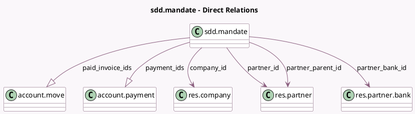

<!-- GENERATED:MODEL -->
---
tags: [odoo, enterprise, generated, model]
---

# sdd.mandate

- Module: [[docs/Enterprise Addons/account_sepa_direct_debit/account_sepa_direct_debit|account_sepa_direct_debit]]
- Scope: Enterprise Addons
- Defined in module: yes
- Source files: `models/sdd_mandate.py`
- Python classes: `SddMandate`
- Description: SDD Mandate
- Inherits: `mail.activity.mixin`, `mail.thread.main.attachment`

## Field footprint

- Detected fields: 19
- Field types: `Binary` x 1, `Boolean` x 3, `Char` x 2, `Date` x 2, `Integer` x 3, `Many2one` x 4, `One2many` x 2, `Selection` x 2
- Relation fields: 6

## Sample fields

- `company_id`: `Many2one` (comodel `res.company`)
- `debtor_id_code`: `Char`
- `end_date`: `Date`
- `expiration_warning_already_sent`: `Boolean`
- `is_sent`: `Boolean`
- `mandate_pdf_file`: `Binary`
- `name`: `Char`
- `one_off`: `Boolean`
- `paid_invoice_ids`: `One2many` (comodel `account.move`, compute `_compute_from_moves`)
- `paid_invoices_nber`: `Integer` (compute `_compute_from_moves`)
- `partner_bank_id`: `Many2one` (comodel `res.partner.bank`)
- `partner_id`: `Many2one` (comodel `res.partner`)
- `partner_parent_id`: `Many2one` (comodel `res.partner`, related `partner_id.parent_id`)
- `payment_ids`: `One2many` (comodel `account.payment`, compute `_compute_from_moves`)
- `payments_to_collect_nber`: `Integer` (compute `_compute_from_moves`)
- `pre_notification_period`: `Integer`
- `sdd_scheme`: `Selection`
- `start_date`: `Date`
- `state`: `Selection`

## Method hints

- Detected methods: 20
- Action methods: `action_cancel_mandate`, `action_close_mandate`, `action_parent_id_from_sdd_mandate`, `action_revoke_mandate`, `action_send_and_print`, `action_validate_mandate`, `action_view_paid_invoices`, `action_view_payments_to_collect`
- Compute methods: `_compute_from_moves`
- Onchange methods: none

## Direct relation diagram

## Navigation

- **Parent:** [[docs/Enterprise Addons/account_sepa_direct_debit/Models]]

<!-- GENERATED:MODEL -->
