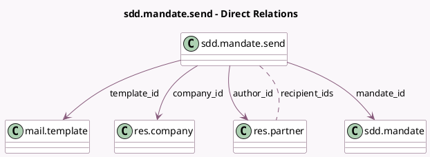

<!-- GENERATED:MODEL -->
---
tags: [odoo, enterprise, generated, model]
---

# sdd.mandate.send

- Module: [[docs/Enterprise Addons/account_sepa_direct_debit/account_sepa_direct_debit|account_sepa_direct_debit]]
- Scope: Enterprise Addons
- Defined in module: yes
- Source files: `wizard/sdd_mandate_send.py`
- Python classes: `SddMandateSend`
- Description: SDD Mandate Send
- Inherits: `mail.composer.mixin`

## Field footprint

- Detected fields: 9
- Field types: `Boolean` x 2, `Json` x 1, `Many2many` x 1, `Many2one` x 5
- Relation fields: 6

## Sample fields

- `author_id`: `Many2one` (comodel `res.partner`)
- `checkbox_download`: `Boolean`
- `checkbox_send_mail`: `Boolean`
- `company_id`: `Many2one` (comodel `res.company`, compute `_compute_company_id`, store `True`)
- `mandate_id`: `Many2one` (comodel `sdd.mandate`)
- `partner_id`: `Many2one` (related `mandate_id.partner_id`)
- `recipient_ids`: `Many2many` (comodel `res.partner`, compute `_compute_recipient_ids`)
- `template_id`: `Many2one` (comodel `mail.template`)
- `warnings`: `Json` (compute `_compute_warnings`)

## Method hints

- Detected methods: 8
- Action methods: `action_send_and_print`
- Compute methods: `_compute_body`, `_compute_company_id`, `_compute_recipient_ids`, `_compute_subject`, `_compute_warnings`
- Onchange methods: none

## Direct relation diagram

## Navigation

- **Parent:** [[docs/Enterprise Addons/account_sepa_direct_debit/Models]]

<!-- GENERATED:MODEL -->
