<!-- GENERATED:MODEL -->
---
tags: [odoo, enterprise, generated, model]
---

# account.transfer.model.line

- Module: [[docs/Enterprise Addons/account_transfer/account_transfer|account_transfer]]
- Scope: Enterprise Addons
- Defined in module: yes
- Source files: `models/transfer_model_line.py`
- Python classes: `AccountTransferModelLine`
- Description: Account Transfer Model Line

## Field footprint

- Detected fields: 4
- Field types: `Float` x 1, `Integer` x 1, `Many2one` x 2
- Relation fields: 2

## Sample fields

- `account_id`: `Many2one` (comodel `account.account`)
- `percent`: `Float`
- `sequence`: `Integer` (comodel `Sequence`)
- `transfer_model_id`: `Many2one` (comodel `account.transfer.model`)

## Method hints

- Detected methods: 1
- Action methods: none
- Compute methods: none
- Onchange methods: none

## Direct relation diagram

```plantuml
@startuml
!define ODOO_COLOR_PRIMARY #714B67
!define ODOO_COLOR_ACCENT #875A7B
!define ODOO_COLOR_BG #FAF7FA

skinparam backgroundColor ODOO_COLOR_BG
skinparam defaultTextAlignment left
skinparam ArrowColor ODOO_COLOR_ACCENT
skinparam ClassBackgroundColor white
skinparam ClassBorderColor ODOO_COLOR_PRIMARY
skinparam ComponentBackgroundColor white
skinparam ComponentBorderColor ODOO_COLOR_PRIMARY
skinparam NoteBackgroundColor #FFF8FF
skinparam NoteBorderColor ODOO_COLOR_ACCENT
skinparam SequenceLifeLineBorderColor ODOO_COLOR_ACCENT
skinparam SequenceLifeLineBackgroundColor #FFFFFF
skinparam SequenceParticipantBorderColor ODOO_COLOR_PRIMARY
skinparam SequenceParticipantBackgroundColor #FFFFFF
skinparam sequence {
  ArrowColor ODOO_COLOR_ACCENT
  ActorBorderColor ODOO_COLOR_PRIMARY
}
title account.transfer.model.line - Direct Relations
class "account.transfer.model.line" as account_transfer_model_line
class "account.account" as account_account
class "account.transfer.model" as account_transfer_model
account_transfer_model_line --> account_transfer_model : transfer_model_id
account_transfer_model_line --> account_account : account_id
@enduml
```

## Navigation

- **Parent:** [[docs/Enterprise Addons/account_transfer/Models]]

<!-- GENERATED:MODEL -->
