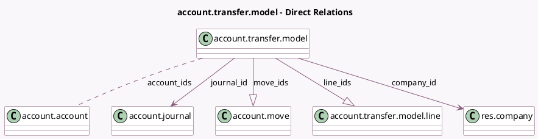

<!-- GENERATED:MODEL -->
---
tags: [odoo, enterprise, generated, model]
---

# account.transfer.model

- Module: [[docs/Enterprise Addons/account_transfer/account_transfer|account_transfer]]
- Scope: Enterprise Addons
- Defined in module: yes
- Source files: `models/transfer_model.py`
- Python classes: `AccountTransferModel`
- Description: Account Transfer Model

## Field footprint

- Detected fields: 15
- Field types: `Boolean` x 2, `Char` x 2, `Date` x 2, `Float` x 1, `Integer` x 1, `Many2many` x 1, `Many2one` x 2, `One2many` x 2, `Selection` x 2
- Relation fields: 5

## Sample fields

- `account_ids`: `Many2many` (comodel `account.account`)
- `active`: `Boolean`
- `company_id`: `Many2one` (comodel `res.company`, related `journal_id.company_id`)
- `conditions`: `Char`
- `date_start`: `Date`
- `date_stop`: `Date`
- `frequency`: `Selection`
- `has_draft_moves`: `Boolean` (compute `_compute_has_draft_moves`)
- `journal_id`: `Many2one` (comodel `account.journal`)
- `line_ids`: `One2many` (comodel `account.transfer.model.line`)
- `move_ids`: `One2many` (comodel `account.move`)
- `move_ids_count`: `Integer` (compute `_compute_move_ids_count`)
- `name`: `Char`
- `state`: `Selection`
- `total_percent`: `Float` (compute `_compute_total_percent`)

## Method hints

- Detected methods: 18
- Action methods: `action_archive`, `action_cron_auto_transfer`, `action_disable`, `action_enable`, `action_perform_auto_transfer`
- Compute methods: `_compute_has_draft_moves`, `_compute_move_ids_count`, `_compute_total_percent`
- Onchange methods: none

## Direct relation diagram

## Navigation

- **Parent:** [[docs/Enterprise Addons/account_transfer/Models]]

<!-- GENERATED:MODEL -->
