<!-- GENERATED:MODEL -->
---
tags: [odoo, enterprise, generated, model]
---

# account.import.summary

- Module: [[docs/Enterprise Addons/account_winbooks_import/account_winbooks_import|account_winbooks_import]]
- Scope: Enterprise Addons
- Defined in module: extension only
- Source files: `wizard/account_import_summary.py`
- Python classes: `AccountImportSummary`

## Field footprint

- Detected fields: 4
- Field types: `Integer` x 2, `Many2many` x 2
- Relation fields: 2

## Sample fields

- `import_summary_analytic_ids`: `Many2many` (comodel `account.analytic.account`)
- `import_summary_analytic_line_ids`: `Many2many` (comodel `account.analytic.line`)
- `import_summary_len_analytic`: `Integer` (compute `_compute_import_summary_len_analytic`)
- `import_summary_len_analytic_line`: `Integer` (compute `_compute_import_summary_len_analytic_line`)

## Method hints

- Detected methods: 5
- Action methods: `action_open_analytic_line_view`, `action_open_analytic_view`
- Compute methods: `_compute_import_summary_have_data`, `_compute_import_summary_len_analytic`, `_compute_import_summary_len_analytic_line`
- Onchange methods: none

## Direct relation diagram

```plantuml
@startuml
!define ODOO_COLOR_PRIMARY #714B67
!define ODOO_COLOR_ACCENT #875A7B
!define ODOO_COLOR_BG #FAF7FA

skinparam backgroundColor ODOO_COLOR_BG
skinparam defaultTextAlignment left
skinparam ArrowColor ODOO_COLOR_ACCENT
skinparam ClassBackgroundColor white
skinparam ClassBorderColor ODOO_COLOR_PRIMARY
skinparam ComponentBackgroundColor white
skinparam ComponentBorderColor ODOO_COLOR_PRIMARY
skinparam NoteBackgroundColor #FFF8FF
skinparam NoteBorderColor ODOO_COLOR_ACCENT
skinparam SequenceLifeLineBorderColor ODOO_COLOR_ACCENT
skinparam SequenceLifeLineBackgroundColor #FFFFFF
skinparam SequenceParticipantBorderColor ODOO_COLOR_PRIMARY
skinparam SequenceParticipantBackgroundColor #FFFFFF
skinparam sequence {
  ArrowColor ODOO_COLOR_ACCENT
  ActorBorderColor ODOO_COLOR_PRIMARY
}
title account.import.summary - Direct Relations
class "account.import.summary" as account_import_summary
class "account.analytic.account" as account_analytic_account
class "account.analytic.line" as account_analytic_line
account_import_summary .. account_analytic_account : import_summary_analytic_ids
account_import_summary .. account_analytic_line : import_summary_analytic_line_ids
@enduml
```

## Navigation

- **Parent:** [[docs/Enterprise Addons/account_winbooks_import/Models]]

<!-- GENERATED:MODEL -->
