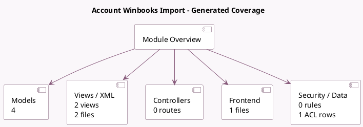

<!-- GENERATED:MODULE -->
---
tags: [odoo, enterprise, module]
---

# Account Winbooks Import

- Scope: Enterprise Addons
- Source: enterprise/account_winbooks_import
- Dependencies: [[docs/Enterprise Addons/account_accountant/account_accountant|account_accountant]], [[docs/Community Addons/base_vat/base_vat|base_vat]], [[docs/Enterprise Addons/account_base_import/account_base_import|account_base_import]]

## Summary

Import Data From Winbooks

## Generated coverage

- Models: 4
- XML files with UI/data artifacts: 2
- Views: 2
- Actions: 1
- Menus: 0
- Rules (ir.rule): 0
- Access CSV entries: 1
- Controller units: 0
- Frontend asset files: 1

## Module map

## Detail notes

- Models: [[docs/Enterprise Addons/account_winbooks_import/Models|Models]] (4)
- Views and XML: [[docs/Enterprise Addons/account_winbooks_import/Views|Views]] (2 files)
- Frontend: [[docs/Enterprise Addons/account_winbooks_import/Frontend|Frontend]] (1 files)

## Key models

- `account.import.summary`
- `account.move.line`
- `account.winbooks.import.wizard`
- `res.company`

## Navigation

- [[../Enterprise Addons/Enterprise Addons|Back to scope]]
- [[../../docs/docs|Back to docs]]

<!-- GENERATED:MODULE -->

