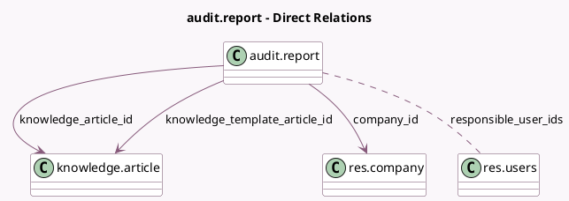

<!-- GENERATED:MODEL -->
---
tags: [odoo, enterprise, generated, model]
---

# audit.report

- Module: [[docs/Enterprise Addons/accountant_knowledge/accountant_knowledge|accountant_knowledge]]
- Scope: Enterprise Addons
- Defined in module: yes
- Source files: `models/audit_report.py`
- Python classes: `AuditReport`
- Description: Audit Report

## Field footprint

- Detected fields: 9
- Field types: `Char` x 1, `Date` x 2, `Integer` x 1, `Many2many` x 1, `Many2one` x 3, `Selection` x 1
- Relation fields: 4

## Sample fields

- `color`: `Integer`
- `company_id`: `Many2one` (comodel `res.company`)
- `end_date`: `Date`
- `knowledge_article_id`: `Many2one` (comodel `knowledge.article`)
- `knowledge_template_article_id`: `Many2one` (comodel `knowledge.article`)
- `responsible_user_ids`: `Many2many` (comodel `res.users`)
- `start_date`: `Date`
- `status`: `Selection`
- `title`: `Char`

## Method hints

- Detected methods: 6
- Action methods: `action_audit_report_pdf`, `action_edit_audit_report`, `action_set_to_done`, `action_set_to_draft`
- Compute methods: none
- Onchange methods: none

## Direct relation diagram

## Navigation

- **Parent:** [[docs/Enterprise Addons/accountant_knowledge/Models]]

<!-- GENERATED:MODEL -->
