<!-- GENERATED:MODEL -->
---
tags: [odoo, enterprise, generated, model]
---

# knowledge.article

- Module: [[docs/Enterprise Addons/accountant_knowledge/accountant_knowledge|accountant_knowledge]]
- Scope: Enterprise Addons
- Defined in module: yes
- Source files: `models/knowledge_article.py`
- Python classes: `KnowledgeArticle`

## Field footprint

- Detected fields: 3
- Field types: `Boolean` x 1, `One2many` x 2
- Relation fields: 2

## Sample fields

- `audit_report_id`: `One2many` (comodel `audit.report`)
- `inherited_audit_report_id`: `One2many` (comodel `audit.report`, compute `_compute_inherited_audit_report`, store `False`)
- `is_audit_report_template`: `Boolean` (comodel `Audit Report Template`)

## Method hints

- Detected methods: 4
- Action methods: none
- Compute methods: `_compute_inherited_audit_report`
- Onchange methods: none

## Direct relation diagram

```plantuml
@startuml
!define ODOO_COLOR_PRIMARY #714B67
!define ODOO_COLOR_ACCENT #875A7B
!define ODOO_COLOR_BG #FAF7FA

skinparam backgroundColor ODOO_COLOR_BG
skinparam defaultTextAlignment left
skinparam ArrowColor ODOO_COLOR_ACCENT
skinparam ClassBackgroundColor white
skinparam ClassBorderColor ODOO_COLOR_PRIMARY
skinparam ComponentBackgroundColor white
skinparam ComponentBorderColor ODOO_COLOR_PRIMARY
skinparam NoteBackgroundColor #FFF8FF
skinparam NoteBorderColor ODOO_COLOR_ACCENT
skinparam SequenceLifeLineBorderColor ODOO_COLOR_ACCENT
skinparam SequenceLifeLineBackgroundColor #FFFFFF
skinparam SequenceParticipantBorderColor ODOO_COLOR_PRIMARY
skinparam SequenceParticipantBackgroundColor #FFFFFF
skinparam sequence {
  ArrowColor ODOO_COLOR_ACCENT
  ActorBorderColor ODOO_COLOR_PRIMARY
}
title knowledge.article - Direct Relations
class "knowledge.article" as knowledge_article
class "audit.report" as audit_report
knowledge_article --|> audit_report : audit_report_id
knowledge_article --|> audit_report : inherited_audit_report_id
@enduml
```

## Navigation

- **Parent:** [[docs/Enterprise Addons/accountant_knowledge/Models]]

<!-- GENERATED:MODEL -->
