<!-- GENERATED:MODEL -->
---
tags: [odoo, enterprise, generated, model]
---

# ai.agent

- Module: [[docs/Enterprise Addons/ai/ai|ai]]
- Scope: Enterprise Addons
- Defined in module: yes
- Source files: `models/ai_agent.py`
- Python classes: `AIAgent`
- Description: AI Agent

## Field footprint

- Detected fields: 15
- Field types: `Boolean` x 5, `Char` x 2, `Image` x 2, `Many2many` x 1, `Many2one` x 1, `One2many` x 1, `Selection` x 2, `Text` x 1
- Relation fields: 3

## Sample fields

- `active`: `Boolean`
- `avatar_128`: `Image` (comodel `Avatar`, related `partner_id.avatar_128`)
- `image_128`: `Image` (comodel `Image`, related `partner_id.image_1920`)
- `is_ask_ai_agent`: `Boolean` (comodel `Is Natural Language Query Agent`, compute `_compute_is_ask_ai_agent`)
- `is_system_agent`: `Boolean` (comodel `System Agent`)
- `llm_model`: `Selection`
- `name`: `Char` (related `partner_id.name`)
- `partner_id`: `Many2one` (comodel `res.partner`)
- `response_style`: `Selection`
- `restrict_to_sources`: `Boolean`
- `sources_fully_processed`: `Boolean` (compute `_compute_sources_fully_processed`)
- `sources_ids`: `One2many` (comodel `ai.agent.source`)
- `subtitle`: `Char`
- `system_prompt`: `Text`
- `topic_ids`: `Many2many` (comodel `ai.topic`)

## Method hints

- Detected methods: 48
- Action methods: `action_ask_ai`, `action_refresh_sources`
- Compute methods: `_compute_is_ask_ai_agent`, `_compute_sources_fully_processed`
- Onchange methods: none

## Direct relation diagram

```plantuml
@startuml
!define ODOO_COLOR_PRIMARY #714B67
!define ODOO_COLOR_ACCENT #875A7B
!define ODOO_COLOR_BG #FAF7FA

skinparam backgroundColor ODOO_COLOR_BG
skinparam defaultTextAlignment left
skinparam ArrowColor ODOO_COLOR_ACCENT
skinparam ClassBackgroundColor white
skinparam ClassBorderColor ODOO_COLOR_PRIMARY
skinparam ComponentBackgroundColor white
skinparam ComponentBorderColor ODOO_COLOR_PRIMARY
skinparam NoteBackgroundColor #FFF8FF
skinparam NoteBorderColor ODOO_COLOR_ACCENT
skinparam SequenceLifeLineBorderColor ODOO_COLOR_ACCENT
skinparam SequenceLifeLineBackgroundColor #FFFFFF
skinparam SequenceParticipantBorderColor ODOO_COLOR_PRIMARY
skinparam SequenceParticipantBackgroundColor #FFFFFF
skinparam sequence {
  ArrowColor ODOO_COLOR_ACCENT
  ActorBorderColor ODOO_COLOR_PRIMARY
}
title ai.agent - Direct Relations
class "ai.agent" as ai_agent
class "ai.agent.source" as ai_agent_source
class "ai.topic" as ai_topic
class "res.partner" as res_partner
ai_agent .. ai_topic : topic_ids
ai_agent --> res_partner : partner_id
ai_agent --|> ai_agent_source : sources_ids
@enduml
```

## Navigation

- **Parent:** [[docs/Enterprise Addons/ai/Models]]

<!-- GENERATED:MODEL -->
