<!-- GENERATED:MODEL -->
---
tags: [odoo, enterprise, generated, model]
---

# ai.agent.source

- Module: [[docs/Enterprise Addons/ai/ai|ai]]
- Scope: Enterprise Addons
- Defined in module: yes
- Source files: `models/ai_agent_source.py`
- Python classes: `AIAgentSource`
- Description: AI Agent Source

## Field footprint

- Detected fields: 11
- Field types: `Boolean` x 2, `Char` x 3, `Integer` x 1, `Many2one` x 2, `Selection` x 2, `Text` x 1
- Relation fields: 2

## Sample fields

- `agent_id`: `Many2one` (comodel `ai.agent`)
- `attachment_id`: `Many2one` (comodel `ir.attachment`)
- `error_details`: `Text`
- `file_size`: `Integer` (related `attachment_id.file_size`)
- `is_active`: `Boolean`
- `mimetype`: `Char` (related `attachment_id.mimetype`)
- `name`: `Char`
- `status`: `Selection`
- `type`: `Selection`
- `url`: `Char`
- `user_has_access`: `Boolean` (compute `_compute_user_has_access`)

## Method hints

- Detected methods: 22
- Action methods: `action_access_source`, `action_open_sources_dialog`, `action_reprocess_index`, `action_retry_failed_source`
- Compute methods: `_compute_user_has_access`
- Onchange methods: none

## Direct relation diagram

```plantuml
@startuml
!define ODOO_COLOR_PRIMARY #714B67
!define ODOO_COLOR_ACCENT #875A7B
!define ODOO_COLOR_BG #FAF7FA

skinparam backgroundColor ODOO_COLOR_BG
skinparam defaultTextAlignment left
skinparam ArrowColor ODOO_COLOR_ACCENT
skinparam ClassBackgroundColor white
skinparam ClassBorderColor ODOO_COLOR_PRIMARY
skinparam ComponentBackgroundColor white
skinparam ComponentBorderColor ODOO_COLOR_PRIMARY
skinparam NoteBackgroundColor #FFF8FF
skinparam NoteBorderColor ODOO_COLOR_ACCENT
skinparam SequenceLifeLineBorderColor ODOO_COLOR_ACCENT
skinparam SequenceLifeLineBackgroundColor #FFFFFF
skinparam SequenceParticipantBorderColor ODOO_COLOR_PRIMARY
skinparam SequenceParticipantBackgroundColor #FFFFFF
skinparam sequence {
  ArrowColor ODOO_COLOR_ACCENT
  ActorBorderColor ODOO_COLOR_PRIMARY
}
title ai.agent.source - Direct Relations
class "ai.agent.source" as ai_agent_source
class "ai.agent" as ai_agent
class "ir.attachment" as ir_attachment
ai_agent_source --> ai_agent : agent_id
ai_agent_source --> ir_attachment : attachment_id
@enduml
```

## Navigation

- **Parent:** [[docs/Enterprise Addons/ai/Models]]

<!-- GENERATED:MODEL -->
