<!-- GENERATED:MODEL -->
---
tags: [odoo, enterprise, generated, model]
---

# ai.composer

- Module: [[docs/Enterprise Addons/ai/ai|ai]]
- Scope: Enterprise Addons
- Defined in module: yes
- Source files: `models/ai_composer.py`
- Python classes: `AIComposer`
- Description: AI model configurations (system prompts) for text drafting.

## Field footprint

- Detected fields: 7
- Field types: `Boolean` x 1, `Char` x 1, `Many2many` x 1, `Many2one` x 1, `One2many` x 1, `Selection` x 1, `Text` x 1
- Relation fields: 3

## Sample fields

- `ai_agent`: `Many2one` (comodel `ai.agent`)
- `available_prompts`: `One2many` (comodel `ai.prompt.button`)
- `default_prompt`: `Text` (comodel `Instructions`)
- `focused_models`: `Many2many` (comodel `ir.model`)
- `interface_key`: `Selection`
- `is_system_default`: `Boolean` (comodel `Is the rule a system default or user created`)
- `name`: `Char` (comodel `Rule Name`)

## Method hints

- Detected methods: 3
- Action methods: none
- Compute methods: none
- Onchange methods: none

## Direct relation diagram

```plantuml
@startuml
!define ODOO_COLOR_PRIMARY #714B67
!define ODOO_COLOR_ACCENT #875A7B
!define ODOO_COLOR_BG #FAF7FA

skinparam backgroundColor ODOO_COLOR_BG
skinparam defaultTextAlignment left
skinparam ArrowColor ODOO_COLOR_ACCENT
skinparam ClassBackgroundColor white
skinparam ClassBorderColor ODOO_COLOR_PRIMARY
skinparam ComponentBackgroundColor white
skinparam ComponentBorderColor ODOO_COLOR_PRIMARY
skinparam NoteBackgroundColor #FFF8FF
skinparam NoteBorderColor ODOO_COLOR_ACCENT
skinparam SequenceLifeLineBorderColor ODOO_COLOR_ACCENT
skinparam SequenceLifeLineBackgroundColor #FFFFFF
skinparam SequenceParticipantBorderColor ODOO_COLOR_PRIMARY
skinparam SequenceParticipantBackgroundColor #FFFFFF
skinparam sequence {
  ArrowColor ODOO_COLOR_ACCENT
  ActorBorderColor ODOO_COLOR_PRIMARY
}
title ai.composer - Direct Relations
class "ai.composer" as ai_composer
class "ai.agent" as ai_agent
class "ai.prompt.button" as ai_prompt_button
class "ir.model" as ir_model
ai_composer .. ir_model : focused_models
ai_composer --> ai_agent : ai_agent
ai_composer --|> ai_prompt_button : available_prompts
@enduml
```

## Navigation

- **Parent:** [[docs/Enterprise Addons/ai/Models]]

<!-- GENERATED:MODEL -->
