<!-- GENERATED:MODEL -->
---
tags: [odoo, enterprise, generated, model]
---

# ai.embedding

- Module: [[docs/Enterprise Addons/ai/ai|ai]]
- Scope: Enterprise Addons
- Defined in module: yes
- Source files: `models/ai_embedding.py`
- Python classes: `AIEmbedding`
- Description: Attachment Chunks Embedding

## Field footprint

- Detected fields: 6
- Field types: `Boolean` x 1, `Char` x 1, `Integer` x 1, `Many2one` x 1, `Selection` x 1, `Text` x 1
- Relation fields: 1

## Sample fields

- `attachment_id`: `Many2one` (comodel `ir.attachment`)
- `checksum`: `Char` (related `attachment_id.checksum`)
- `content`: `Text`
- `embedding_model`: `Selection`
- `has_embedding_generation_failed`: `Boolean`
- `sequence`: `Integer`

## Method hints

- Detected methods: 8
- Action methods: none
- Compute methods: none
- Onchange methods: none

## Direct relation diagram

```plantuml
@startuml
!define ODOO_COLOR_PRIMARY #714B67
!define ODOO_COLOR_ACCENT #875A7B
!define ODOO_COLOR_BG #FAF7FA

skinparam backgroundColor ODOO_COLOR_BG
skinparam defaultTextAlignment left
skinparam ArrowColor ODOO_COLOR_ACCENT
skinparam ClassBackgroundColor white
skinparam ClassBorderColor ODOO_COLOR_PRIMARY
skinparam ComponentBackgroundColor white
skinparam ComponentBorderColor ODOO_COLOR_PRIMARY
skinparam NoteBackgroundColor #FFF8FF
skinparam NoteBorderColor ODOO_COLOR_ACCENT
skinparam SequenceLifeLineBorderColor ODOO_COLOR_ACCENT
skinparam SequenceLifeLineBackgroundColor #FFFFFF
skinparam SequenceParticipantBorderColor ODOO_COLOR_PRIMARY
skinparam SequenceParticipantBackgroundColor #FFFFFF
skinparam sequence {
  ArrowColor ODOO_COLOR_ACCENT
  ActorBorderColor ODOO_COLOR_PRIMARY
}
title ai.embedding - Direct Relations
class "ai.embedding" as ai_embedding
class "ir.attachment" as ir_attachment
ai_embedding --> ir_attachment : attachment_id
@enduml
```

## Navigation

- **Parent:** [[docs/Enterprise Addons/ai/Models]]

<!-- GENERATED:MODEL -->
