<!-- GENERATED:MODEL -->
---
tags: [odoo, enterprise, generated, model]
---

# ai.prompt.button

- Module: [[docs/Enterprise Addons/ai/ai|ai]]
- Scope: Enterprise Addons
- Defined in module: yes
- Source files: `models/ai_prompt_button.py`
- Python classes: `AIPromptButton`
- Description: Prompt that can be attached to AI UI rules for quick access by the user.

## Field footprint

- Detected fields: 3
- Field types: `Char` x 1, `Integer` x 1, `Many2one` x 1
- Relation fields: 1

## Sample fields

- `composer_id`: `Many2one` (comodel `ai.composer`)
- `name`: `Char` (comodel `AI Prompt`)
- `sequence`: `Integer`

## Method hints

- Detected methods: 1
- Action methods: none
- Compute methods: none
- Onchange methods: none

## Direct relation diagram

```plantuml
@startuml
!define ODOO_COLOR_PRIMARY #714B67
!define ODOO_COLOR_ACCENT #875A7B
!define ODOO_COLOR_BG #FAF7FA

skinparam backgroundColor ODOO_COLOR_BG
skinparam defaultTextAlignment left
skinparam ArrowColor ODOO_COLOR_ACCENT
skinparam ClassBackgroundColor white
skinparam ClassBorderColor ODOO_COLOR_PRIMARY
skinparam ComponentBackgroundColor white
skinparam ComponentBorderColor ODOO_COLOR_PRIMARY
skinparam NoteBackgroundColor #FFF8FF
skinparam NoteBorderColor ODOO_COLOR_ACCENT
skinparam SequenceLifeLineBorderColor ODOO_COLOR_ACCENT
skinparam SequenceLifeLineBackgroundColor #FFFFFF
skinparam SequenceParticipantBorderColor ODOO_COLOR_PRIMARY
skinparam SequenceParticipantBackgroundColor #FFFFFF
skinparam sequence {
  ArrowColor ODOO_COLOR_ACCENT
  ActorBorderColor ODOO_COLOR_PRIMARY
}
title ai.prompt.button - Direct Relations
class "ai.prompt.button" as ai_prompt_button
class "ai.composer" as ai_composer
ai_prompt_button --> ai_composer : composer_id
@enduml
```

## Navigation

- **Parent:** [[docs/Enterprise Addons/ai/Models]]

<!-- GENERATED:MODEL -->
