<!-- GENERATED:MODEL -->
---
tags: [odoo, enterprise, generated, model]
---

# ir.actions.server

- Module: [[docs/Enterprise Addons/ai/ai|ai]]
- Scope: Enterprise Addons
- Defined in module: extension only
- Source files: `models/ir_actions_server.py`
- Python classes: `IrActionsServer`

## Field footprint

- Detected fields: 10
- Field types: `Boolean` x 5, `Html` x 1, `Many2many` x 1, `Selection` x 1, `Text` x 2
- Relation fields: 1

## Sample fields

- `ai_action_prompt`: `Html`
- `ai_tool_allow_end_message`: `Boolean` (comodel `Allow End Message`)
- `ai_tool_description`: `Text` (comodel `AI Tool Description`)
- `ai_tool_has_schema`: `Boolean` (compute `_compute_ai_tool_has_schema`)
- `ai_tool_ids`: `Many2many` (comodel `ir.actions.server`)
- `ai_tool_is_candidate`: `Boolean` (compute `_compute_ai_tool_is_candidate`)
- `ai_tool_schema`: `Text` (comodel `AI Schema`, compute `_compute_use_in_ai`, store `True`)
- `ai_tool_show_warning`: `Boolean` (compute `_compute_ai_tool_show_warning`)
- `state`: `Selection`
- `use_in_ai`: `Boolean` (comodel `Use in AI`, compute `_compute_use_in_ai`, store `True`)

## Method hints

- Detected methods: 16
- Action methods: none
- Compute methods: `_compute_ai_tool_has_schema`, `_compute_ai_tool_is_candidate`, `_compute_ai_tool_show_warning`, `_compute_allowed_states`, `_compute_use_in_ai`
- Onchange methods: none

## Direct relation diagram

```plantuml
@startuml
!define ODOO_COLOR_PRIMARY #714B67
!define ODOO_COLOR_ACCENT #875A7B
!define ODOO_COLOR_BG #FAF7FA

skinparam backgroundColor ODOO_COLOR_BG
skinparam defaultTextAlignment left
skinparam ArrowColor ODOO_COLOR_ACCENT
skinparam ClassBackgroundColor white
skinparam ClassBorderColor ODOO_COLOR_PRIMARY
skinparam ComponentBackgroundColor white
skinparam ComponentBorderColor ODOO_COLOR_PRIMARY
skinparam NoteBackgroundColor #FFF8FF
skinparam NoteBorderColor ODOO_COLOR_ACCENT
skinparam SequenceLifeLineBorderColor ODOO_COLOR_ACCENT
skinparam SequenceLifeLineBackgroundColor #FFFFFF
skinparam SequenceParticipantBorderColor ODOO_COLOR_PRIMARY
skinparam SequenceParticipantBackgroundColor #FFFFFF
skinparam sequence {
  ArrowColor ODOO_COLOR_ACCENT
  ActorBorderColor ODOO_COLOR_PRIMARY
}
title ir.actions.server - Direct Relations
class "ir.actions.server" as ir_actions_server
class "ir.actions.server" as ir_actions_server
ir_actions_server .. ir_actions_server : ai_tool_ids
@enduml
```

## Navigation

- **Parent:** [[docs/Enterprise Addons/ai/Models]]

<!-- GENERATED:MODEL -->
