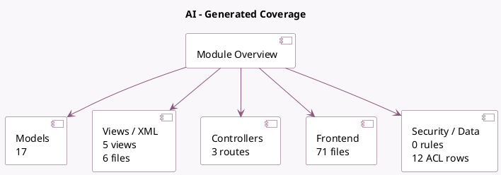

<!-- GENERATED:MODULE -->
---
tags: [odoo, enterprise, module]
---

# AI

- Scope: Enterprise Addons
- Source: enterprise/ai
- Dependencies: [[docs/Community Addons/mail/mail|mail]]

## Summary

Base module for AI features

## Generated coverage

- Models: 17
- XML files with UI/data artifacts: 6
- Views: 5
- Actions: 10
- Menus: 0
- Rules (ir.rule): 0
- Access CSV entries: 12
- Controller units: 2
- Frontend asset files: 71

## Module map

## Detail notes

- Models: [[docs/Enterprise Addons/ai/Models|Models]] (17)
- Views and XML: [[docs/Enterprise Addons/ai/Views|Views]] (6 files)
- Controllers: [[docs/Enterprise Addons/ai/Controllers|Controllers]] (2)
- Frontend: [[docs/Enterprise Addons/ai/Frontend|Frontend]] (71 files)

## Key models

- `ai.agent`
- `ai.agent.source`
- `ai.composer`
- `ai.embedding`
- `ai.prompt.button`
- `ai.topic`
- `base`
- `discuss.channel`
- `ir.actions.server`
- `ir.attachment`
- `ir.http`
- `mail.composer.mixin`

## Navigation

- [[../Enterprise Addons/Enterprise Addons|Back to scope]]
- [[../../docs/docs|Back to docs]]

<!-- GENERATED:MODULE -->

