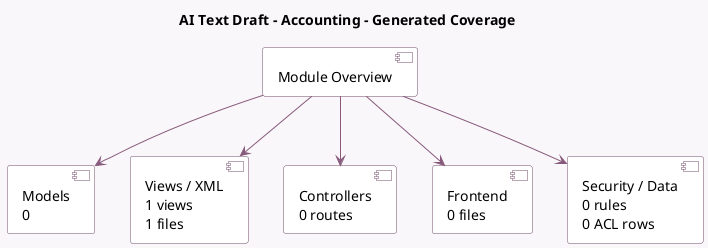

<!-- GENERATED:MODULE -->
---
tags: [odoo, enterprise, module]
---

# AI Text Draft - Accounting

- Scope: Enterprise Addons
- Source: enterprise/ai_account
- Dependencies: [[docs/Enterprise Addons/ai/ai|ai]], [[docs/Community Addons/account/account|account]]

## Summary

AI text draft integration with accounting

## Generated coverage

- Models: 0
- XML files with UI/data artifacts: 1
- Views: 1
- Actions: 0
- Menus: 0
- Rules (ir.rule): 0
- Access CSV entries: 0
- Controller units: 0
- Frontend asset files: 0

## Module map

## Detail notes

- Views and XML: [[docs/Enterprise Addons/ai_account/Views|Views]] (1 files)

## Navigation

- [[../Enterprise Addons/Enterprise Addons|Back to scope]]
- [[../../docs/docs|Back to docs]]

<!-- GENERATED:MODULE -->

