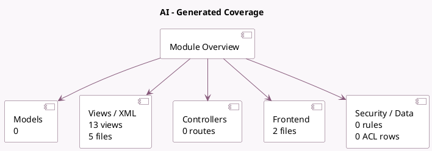

<!-- GENERATED:MODULE -->
---
tags: [odoo, enterprise, module]
---

# AI

- Scope: Enterprise Addons
- Source: enterprise/ai_app
- Dependencies: [[docs/Community Addons/attachment_indexation/attachment_indexation|attachment_indexation]], [[docs/Enterprise Addons/ai/ai|ai]]

## Summary

        A powerful suite of AI tools and agents
        integrated directly into your Odoo environment.

## Generated coverage

- Models: 0
- XML files with UI/data artifacts: 5
- Views: 13
- Actions: 4
- Menus: 7
- Rules (ir.rule): 0
- Access CSV entries: 0
- Controller units: 0
- Frontend asset files: 2

## Module map

## Detail notes

- Views and XML: [[docs/Enterprise Addons/ai_app/Views|Views]] (5 files)
- Frontend: [[docs/Enterprise Addons/ai_app/Frontend|Frontend]] (2 files)

## Navigation

- [[../Enterprise Addons/Enterprise Addons|Back to scope]]
- [[../../docs/docs|Back to docs]]

<!-- GENERATED:MODULE -->

