<!-- GENERATED:MODEL -->
---
tags: [odoo, enterprise, generated, model]
---

# ai_documents.sort

- Module: [[docs/Enterprise Addons/ai_documents/ai_documents|ai_documents]]
- Scope: Enterprise Addons
- Defined in module: yes
- Source files: `wizard/ai_documents_sort.py`
- Python classes: `AiDocumentsSort`
- Description: Ai Documents Sort

## Field footprint

- Detected fields: 7
- Field types: `Boolean` x 1, `Char` x 2, `Html` x 1, `Many2many` x 2, `Many2one` x 1
- Relation fields: 3

## Sample fields

- `ai_sort_prompt`: `Html`
- `ai_tool_ids`: `Many2many` (comodel `ir.actions.server`)
- `allowed_tools_ids`: `Many2many` (comodel `ir.actions.server`, compute `_compute_allowed_tools_ids`)
- `folder_id`: `Many2one` (comodel `documents.document`)
- `is_ai_sort_prompt_set`: `Boolean` (comodel `Is Prompt Set`, compute `_compute_is_prompt_set`)
- `model`: `Char` (compute `_compute_ui_fields`)
- `relation`: `Char` (compute `_compute_ui_fields`)

## Method hints

- Detected methods: 7
- Action methods: `action_delete`, `action_setup_folder`
- Compute methods: `_compute_allowed_tools_ids`, `_compute_is_prompt_set`, `_compute_ui_fields`
- Onchange methods: none

## Direct relation diagram

```plantuml
@startuml
!define ODOO_COLOR_PRIMARY #714B67
!define ODOO_COLOR_ACCENT #875A7B
!define ODOO_COLOR_BG #FAF7FA

skinparam backgroundColor ODOO_COLOR_BG
skinparam defaultTextAlignment left
skinparam ArrowColor ODOO_COLOR_ACCENT
skinparam ClassBackgroundColor white
skinparam ClassBorderColor ODOO_COLOR_PRIMARY
skinparam ComponentBackgroundColor white
skinparam ComponentBorderColor ODOO_COLOR_PRIMARY
skinparam NoteBackgroundColor #FFF8FF
skinparam NoteBorderColor ODOO_COLOR_ACCENT
skinparam SequenceLifeLineBorderColor ODOO_COLOR_ACCENT
skinparam SequenceLifeLineBackgroundColor #FFFFFF
skinparam SequenceParticipantBorderColor ODOO_COLOR_PRIMARY
skinparam SequenceParticipantBackgroundColor #FFFFFF
skinparam sequence {
  ArrowColor ODOO_COLOR_ACCENT
  ActorBorderColor ODOO_COLOR_PRIMARY
}
title ai_documents.sort - Direct Relations
class "ai_documents.sort" as ai_documents_sort
class "documents.document" as documents_document
class "ir.actions.server" as ir_actions_server
ai_documents_sort --> documents_document : folder_id
ai_documents_sort .. ir_actions_server : ai_tool_ids
ai_documents_sort .. ir_actions_server : allowed_tools_ids
@enduml
```

## Navigation

- **Parent:** [[docs/Enterprise Addons/ai_documents/Models]]

<!-- GENERATED:MODEL -->
