<!-- GENERATED:MODEL -->
---
tags: [odoo, enterprise, generated, model]
---

# ai.agent.source

- Module: [[docs/Enterprise Addons/ai_knowledge/ai_knowledge|ai_knowledge]]
- Scope: Enterprise Addons
- Defined in module: yes
- Source files: `models/ai_agent_source.py`
- Python classes: `AIAgentSource`

## Field footprint

- Detected fields: 2
- Field types: `Many2one` x 1, `Selection` x 1
- Relation fields: 1

## Sample fields

- `article_id`: `Many2one` (comodel `knowledge.article`)
- `type`: `Selection`

## Method hints

- Detected methods: 6
- Action methods: `action_access_source`
- Compute methods: `_compute_user_has_access`
- Onchange methods: none

## Direct relation diagram

```plantuml
@startuml
!define ODOO_COLOR_PRIMARY #714B67
!define ODOO_COLOR_ACCENT #875A7B
!define ODOO_COLOR_BG #FAF7FA

skinparam backgroundColor ODOO_COLOR_BG
skinparam defaultTextAlignment left
skinparam ArrowColor ODOO_COLOR_ACCENT
skinparam ClassBackgroundColor white
skinparam ClassBorderColor ODOO_COLOR_PRIMARY
skinparam ComponentBackgroundColor white
skinparam ComponentBorderColor ODOO_COLOR_PRIMARY
skinparam NoteBackgroundColor #FFF8FF
skinparam NoteBorderColor ODOO_COLOR_ACCENT
skinparam SequenceLifeLineBorderColor ODOO_COLOR_ACCENT
skinparam SequenceLifeLineBackgroundColor #FFFFFF
skinparam SequenceParticipantBorderColor ODOO_COLOR_PRIMARY
skinparam SequenceParticipantBackgroundColor #FFFFFF
skinparam sequence {
  ArrowColor ODOO_COLOR_ACCENT
  ActorBorderColor ODOO_COLOR_PRIMARY
}
title ai.agent.source - Direct Relations
class "ai.agent.source" as ai_agent_source
class "knowledge.article" as knowledge_article
ai_agent_source --> knowledge_article : article_id
@enduml
```

## Navigation

- **Parent:** [[docs/Enterprise Addons/ai_knowledge/Models]]

<!-- GENERATED:MODEL -->
