<!-- GENERATED:MODEL -->
---
tags: [odoo, enterprise, generated, model]
---

# im_livechat.channel.member.history

- Module: [[docs/Enterprise Addons/ai_livechat/ai_livechat|ai_livechat]]
- Scope: Enterprise Addons
- Defined in module: extension only
- Source files: `models/im_livechat_channel_member_history.py`
- Python classes: `ImLivechatChannelMemberHistory`

## Field footprint

- Detected fields: 1
- Field types: `Many2one` x 1
- Relation fields: 1

## Sample fields

- `ai_agent_id`: `Many2one` (comodel `ai.agent`, compute `_compute_member_fields`, store `True`)

## Method hints

- Detected methods: 1
- Action methods: none
- Compute methods: `_compute_member_fields`
- Onchange methods: none

## Direct relation diagram

```plantuml
@startuml
!define ODOO_COLOR_PRIMARY #714B67
!define ODOO_COLOR_ACCENT #875A7B
!define ODOO_COLOR_BG #FAF7FA

skinparam backgroundColor ODOO_COLOR_BG
skinparam defaultTextAlignment left
skinparam ArrowColor ODOO_COLOR_ACCENT
skinparam ClassBackgroundColor white
skinparam ClassBorderColor ODOO_COLOR_PRIMARY
skinparam ComponentBackgroundColor white
skinparam ComponentBorderColor ODOO_COLOR_PRIMARY
skinparam NoteBackgroundColor #FFF8FF
skinparam NoteBorderColor ODOO_COLOR_ACCENT
skinparam SequenceLifeLineBorderColor ODOO_COLOR_ACCENT
skinparam SequenceLifeLineBackgroundColor #FFFFFF
skinparam SequenceParticipantBorderColor ODOO_COLOR_PRIMARY
skinparam SequenceParticipantBackgroundColor #FFFFFF
skinparam sequence {
  ArrowColor ODOO_COLOR_ACCENT
  ActorBorderColor ODOO_COLOR_PRIMARY
}
title im_livechat.channel.member.history - Direct Relations
class "im_livechat.channel.member.history" as im_livechat_channel_member_history
class "ai.agent" as ai_agent
im_livechat_channel_member_history --> ai_agent : ai_agent_id
@enduml
```

## Navigation

- **Parent:** [[docs/Enterprise Addons/ai_livechat/Models]]

<!-- GENERATED:MODEL -->
