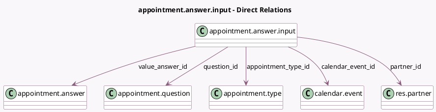

<!-- GENERATED:MODEL -->
---
tags: [odoo, enterprise, generated, model]
---

# appointment.answer.input

- Module: [[docs/Enterprise Addons/appointment/appointment|appointment]]
- Scope: Enterprise Addons
- Defined in module: yes
- Source files: `models/appointment_answer.py`
- Python classes: `AppointmentAnswerInput`
- Description: Appointment Answer Inputs

## Field footprint

- Detected fields: 7
- Field types: `Many2one` x 5, `Selection` x 1, `Text` x 1
- Relation fields: 5

## Sample fields

- `appointment_type_id`: `Many2one` (comodel `appointment.type`)
- `calendar_event_id`: `Many2one` (comodel `calendar.event`)
- `partner_id`: `Many2one` (comodel `res.partner`)
- `question_id`: `Many2one` (comodel `appointment.question`)
- `question_type`: `Selection` (related `question_id.question_type`)
- `value_answer_id`: `Many2one` (comodel `appointment.answer`)
- `value_text_box`: `Text` (comodel `Text Answer`)

## Method hints

- Detected methods: 0
- Action methods: none
- Compute methods: none
- Onchange methods: none

## Direct relation diagram

## Navigation

- **Parent:** [[docs/Enterprise Addons/appointment/Models]]

<!-- GENERATED:MODEL -->
