<!-- GENERATED:MODEL -->
---
tags: [odoo, enterprise, generated, model]
---

# appointment.answer

- Module: [[docs/Enterprise Addons/appointment/appointment|appointment]]
- Scope: Enterprise Addons
- Defined in module: yes
- Source files: `models/appointment_answer.py`
- Python classes: `AppointmentAnswer`
- Description: Appointment Question Answers

## Field footprint

- Detected fields: 3
- Field types: `Char` x 1, `Integer` x 1, `Many2one` x 1
- Relation fields: 1

## Sample fields

- `name`: `Char` (comodel `Answer`)
- `question_id`: `Many2one` (comodel `appointment.question`)
- `sequence`: `Integer`

## Method hints

- Detected methods: 0
- Action methods: none
- Compute methods: none
- Onchange methods: none

## Direct relation diagram

```plantuml
@startuml
!define ODOO_COLOR_PRIMARY #714B67
!define ODOO_COLOR_ACCENT #875A7B
!define ODOO_COLOR_BG #FAF7FA

skinparam backgroundColor ODOO_COLOR_BG
skinparam defaultTextAlignment left
skinparam ArrowColor ODOO_COLOR_ACCENT
skinparam ClassBackgroundColor white
skinparam ClassBorderColor ODOO_COLOR_PRIMARY
skinparam ComponentBackgroundColor white
skinparam ComponentBorderColor ODOO_COLOR_PRIMARY
skinparam NoteBackgroundColor #FFF8FF
skinparam NoteBorderColor ODOO_COLOR_ACCENT
skinparam SequenceLifeLineBorderColor ODOO_COLOR_ACCENT
skinparam SequenceLifeLineBackgroundColor #FFFFFF
skinparam SequenceParticipantBorderColor ODOO_COLOR_PRIMARY
skinparam SequenceParticipantBackgroundColor #FFFFFF
skinparam sequence {
  ArrowColor ODOO_COLOR_ACCENT
  ActorBorderColor ODOO_COLOR_PRIMARY
}
title appointment.answer - Direct Relations
class "appointment.answer" as appointment_answer
class "appointment.question" as appointment_question
appointment_answer --> appointment_question : question_id
@enduml
```

## Navigation

- **Parent:** [[docs/Enterprise Addons/appointment/Models]]

<!-- GENERATED:MODEL -->
