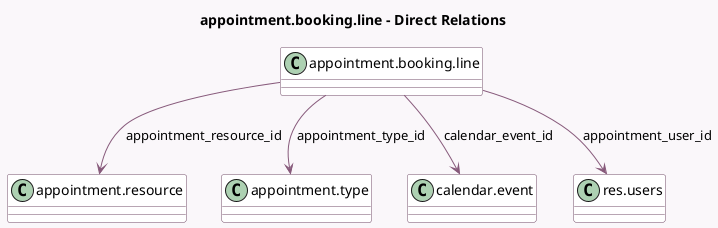

<!-- GENERATED:MODEL -->
---
tags: [odoo, enterprise, generated, model]
---

# appointment.booking.line

- Module: [[docs/Enterprise Addons/appointment/appointment|appointment]]
- Scope: Enterprise Addons
- Defined in module: yes
- Source files: `models/appointment_booking_line.py`
- Python classes: `AppointmentBookingLine`
- Description: Appointment Booking Line

## Field footprint

- Detected fields: 9
- Field types: `Boolean` x 1, `Datetime` x 2, `Integer` x 2, `Many2one` x 4
- Relation fields: 4

## Sample fields

- `active`: `Boolean` (related `calendar_event_id.active`)
- `appointment_resource_id`: `Many2one` (comodel `appointment.resource`)
- `appointment_type_id`: `Many2one` (comodel `appointment.type`, related `calendar_event_id.appointment_type_id`, store `True`)
- `appointment_user_id`: `Many2one` (comodel `res.users`, related `calendar_event_id.user_id`)
- `calendar_event_id`: `Many2one` (comodel `calendar.event`)
- `capacity_reserved`: `Integer` (comodel `Capacity Reserved`)
- `capacity_used`: `Integer` (comodel `Capacity Used`, compute `_compute_capacity_used`, store `True`)
- `event_start`: `Datetime` (comodel `Booking Start`, related `calendar_event_id.start`, store `True`)
- `event_stop`: `Datetime` (comodel `Booking End`, related `calendar_event_id.stop`, store `True`)

## Method hints

- Detected methods: 3
- Action methods: none
- Compute methods: `_compute_capacity_used`
- Onchange methods: none

## Direct relation diagram

## Navigation

- **Parent:** [[docs/Enterprise Addons/appointment/Models]]

<!-- GENERATED:MODEL -->
