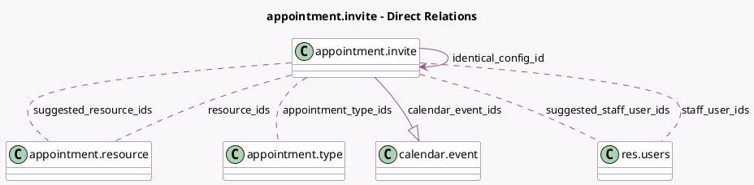

<!-- GENERATED:MODEL -->
---
tags: [odoo, enterprise, generated, model]
---

# appointment.invite

- Module: [[docs/Enterprise Addons/appointment/appointment|appointment]]
- Scope: Enterprise Addons
- Defined in module: yes
- Source files: `models/appointment_invite.py`
- Python classes: `AppointmentInvite`
- Description: Appointment Invite

## Field footprint

- Detected fields: 24
- Field types: `Boolean` x 3, `Char` x 7, `Html` x 1, `Integer` x 4, `Many2many` x 5, `Many2one` x 1, `One2many` x 1, `Selection` x 2
- Relation fields: 7

## Sample fields

- `access_token`: `Char` (comodel `Token`)
- `appointment_type_count`: `Integer` (comodel `Selected Appointments Count`, compute `_compute_appointment_type_count`, store `True`)
- `appointment_type_ids`: `Many2many` (comodel `appointment.type`)
- `appointment_type_info_msg`: `Html` (comodel `No User Assigned Message`, compute `_compute_appointment_type_info_msg`)
- `base_book_url`: `Char` (comodel `Base Link URL`, compute `_compute_base_book_url`)
- `book_url`: `Char` (comodel `Link URL`, compute `_compute_book_url`)
- `book_url_params`: `Char` (comodel `Link URL params`, compute `_compute_book_url_params`)
- `calendar_event_count`: `Integer` (comodel `# Bookings`, compute `_compute_calendar_event_count`)
- `calendar_event_ids`: `One2many` (comodel `calendar.event`)
- `disable_save_button`: `Boolean` (comodel `Computes if alert is present`, compute `_compute_disable_save_button`)
- `identical_config_id`: `Many2one` (comodel `appointment.invite`)
- `redirect_url`: `Char` (comodel `Redirect URL`, compute `_compute_redirect_url`)
- `resource_ids`: `Many2many` (comodel `appointment.resource`, compute `_compute_resource_ids`, store `True`)
- `resources_choice`: `Selection` (compute `_compute_resources_choice`, store `True`)
- `resources_resource_choice`: `Selection` (compute `_compute_resources_resource_choice`)
- `schedule_based_on`: `Char` (comodel `Schedule Based On`, compute `_compute_schedule_based_on`)
- `short_code`: `Char` (comodel `Short Code`)
- `short_code_format_warning`: `Boolean` (comodel `Short Code Format Warning`, compute `_compute_short_code_warning`)
- `short_code_unique_warning`: `Boolean` (comodel `Short Code Unique Warning`, compute `_compute_short_code_warning`)
- `staff_user_ids`: `Many2many` (comodel `res.users`, compute `_compute_staff_user_ids`, store `True`)

## Method hints

- Detected methods: 27
- Action methods: none
- Compute methods: `_compute_appointment_type_count`, `_compute_appointment_type_info_msg`, `_compute_base_book_url`, `_compute_book_url`, `_compute_book_url_params`, `_compute_calendar_event_count`, `_compute_disable_save_button`, `_compute_redirect_url`, and 8 more
- Onchange methods: `_onchange_configuration`

## Direct relation diagram

## Navigation

- **Parent:** [[docs/Enterprise Addons/appointment/Models]]

<!-- GENERATED:MODEL -->
