<!-- GENERATED:MODEL -->
---
tags: [odoo, enterprise, generated, model]
---

# appointment.manage.leaves

- Module: [[docs/Enterprise Addons/appointment/appointment|appointment]]
- Scope: Enterprise Addons
- Defined in module: yes
- Source files: `wizard/appointment_manage_leaves.py`
- Python classes: `AppointmentManageLeaves`
- Description: Add or remove leaves from appointments

## Field footprint

- Detected fields: 4
- Field types: `Char` x 1, `Datetime` x 2, `Many2many` x 1
- Relation fields: 1

## Sample fields

- `appointment_resource_ids`: `Many2many` (comodel `appointment.resource`)
- `leave_end_dt`: `Datetime` (comodel `End Date`)
- `leave_start_dt`: `Datetime` (comodel `Start Date`)
- `reason`: `Char` (comodel `Reason`)

## Method hints

- Detected methods: 2
- Action methods: `action_create_leave`
- Compute methods: none
- Onchange methods: none

## Direct relation diagram

```plantuml
@startuml
!define ODOO_COLOR_PRIMARY #714B67
!define ODOO_COLOR_ACCENT #875A7B
!define ODOO_COLOR_BG #FAF7FA

skinparam backgroundColor ODOO_COLOR_BG
skinparam defaultTextAlignment left
skinparam ArrowColor ODOO_COLOR_ACCENT
skinparam ClassBackgroundColor white
skinparam ClassBorderColor ODOO_COLOR_PRIMARY
skinparam ComponentBackgroundColor white
skinparam ComponentBorderColor ODOO_COLOR_PRIMARY
skinparam NoteBackgroundColor #FFF8FF
skinparam NoteBorderColor ODOO_COLOR_ACCENT
skinparam SequenceLifeLineBorderColor ODOO_COLOR_ACCENT
skinparam SequenceLifeLineBackgroundColor #FFFFFF
skinparam SequenceParticipantBorderColor ODOO_COLOR_PRIMARY
skinparam SequenceParticipantBackgroundColor #FFFFFF
skinparam sequence {
  ArrowColor ODOO_COLOR_ACCENT
  ActorBorderColor ODOO_COLOR_PRIMARY
}
title appointment.manage.leaves - Direct Relations
class "appointment.manage.leaves" as appointment_manage_leaves
class "appointment.resource" as appointment_resource
appointment_manage_leaves .. appointment_resource : appointment_resource_ids
@enduml
```

## Navigation

- **Parent:** [[docs/Enterprise Addons/appointment/Models]]

<!-- GENERATED:MODEL -->
