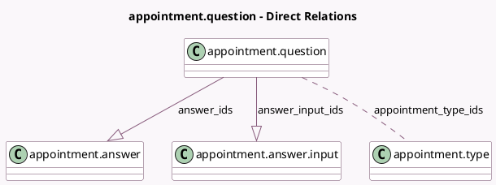

<!-- GENERATED:MODEL -->
---
tags: [odoo, enterprise, generated, model]
---

# appointment.question

- Module: [[docs/Enterprise Addons/appointment/appointment|appointment]]
- Scope: Enterprise Addons
- Defined in module: yes
- Source files: `models/appointment_question.py`
- Python classes: `AppointmentQuestion`
- Description: Appointment Questions

## Field footprint

- Detected fields: 13
- Field types: `Boolean` x 4, `Char` x 2, `Html` x 1, `Integer` x 2, `Many2many` x 1, `One2many` x 2, `Selection` x 1
- Relation fields: 3

## Sample fields

- `active`: `Boolean` (comodel `Active`)
- `answer_ids`: `One2many` (comodel `appointment.answer`)
- `answer_input_ids`: `One2many` (comodel `appointment.answer.input`)
- `appointment_count`: `Integer` (comodel `# Appointments`, compute `_compute_appointment_count`)
- `appointment_type_ids`: `Many2many` (comodel `appointment.type`)
- `extra_comment`: `Html` (comodel `Extra Comment`)
- `is_default`: `Boolean` (comodel `Default question`)
- `is_reusable`: `Boolean` (comodel `Is Reusable`, compute `_compute_is_reusable`, store `True`)
- `name`: `Char` (comodel `Question`)
- `placeholder`: `Char` (comodel `Placeholder`)
- `question_required`: `Boolean` (comodel `Mandatory Answer`)
- `question_type`: `Selection`
- `sequence`: `Integer` (comodel `Sequence`)

## Method hints

- Detected methods: 5
- Action methods: `action_view_appointment_types`, `action_view_question_answer_inputs`
- Compute methods: `_compute_appointment_count`, `_compute_is_reusable`
- Onchange methods: none

## Direct relation diagram

## Navigation

- **Parent:** [[docs/Enterprise Addons/appointment/Models]]

<!-- GENERATED:MODEL -->
