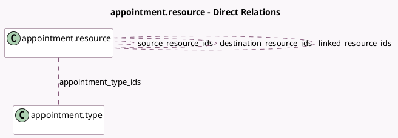

<!-- GENERATED:MODEL -->
---
tags: [odoo, enterprise, generated, model]
---

# appointment.resource

- Module: [[docs/Enterprise Addons/appointment/appointment|appointment]]
- Scope: Enterprise Addons
- Defined in module: yes
- Source files: `models/appointment_resource.py`
- Python classes: `AppointmentResource`
- Description: Appointment Resource
- Inherits: `avatar.mixin`, `resource.mixin`

## Field footprint

- Detected fields: 13
- Field types: `Boolean` x 2, `Char` x 1, `Html` x 1, `Integer` x 2, `Many2many` x 4, `Many2one` x 3
- Relation fields: 7

## Sample fields

- `active`: `Boolean` (comodel `Active`, related `resource_id.active`, store `True`)
- `appointment_type_ids`: `Many2many` (comodel `appointment.type`)
- `capacity`: `Integer` (comodel `Capacity`)
- `company_id`: `Many2one`
- `description`: `Html` (comodel `Description`)
- `destination_resource_ids`: `Many2many` (comodel `appointment.resource`)
- `linked_resource_ids`: `Many2many` (comodel `appointment.resource`, compute `_compute_linked_resource_ids`, store `False`)
- `name`: `Char` (comodel `Name`, related `resource_id.name`, store `True`)
- `resource_calendar_id`: `Many2one`
- `resource_id`: `Many2one`
- `sequence`: `Integer` (comodel `Sequence`)
- `shareable`: `Boolean` (comodel `Shareable`)
- `source_resource_ids`: `Many2many` (comodel `appointment.resource`)

## Method hints

- Detected methods: 7
- Action methods: none
- Compute methods: `_compute_display_name`, `_compute_linked_resource_ids`
- Onchange methods: none

## Direct relation diagram

## Navigation

- **Parent:** [[docs/Enterprise Addons/appointment/Models]]

<!-- GENERATED:MODEL -->
