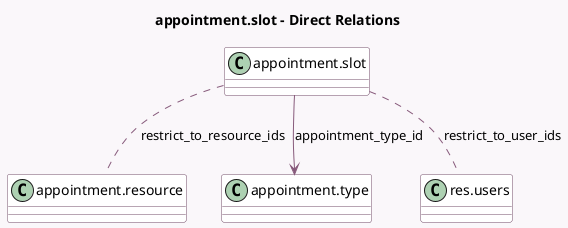

<!-- GENERATED:MODEL -->
---
tags: [odoo, enterprise, generated, model]
---

# appointment.slot

- Module: [[docs/Enterprise Addons/appointment/appointment|appointment]]
- Scope: Enterprise Addons
- Defined in module: yes
- Source files: `models/appointment_slot.py`
- Python classes: `AppointmentSlot`
- Description: Appointment: Time Slot

## Field footprint

- Detected fields: 12
- Field types: `Boolean` x 1, `Datetime` x 2, `Float` x 3, `Many2many` x 2, `Many2one` x 1, `Selection` x 3
- Relation fields: 3

## Sample fields

- `allday`: `Boolean` (comodel `All day`)
- `appointment_type_id`: `Many2one` (comodel `appointment.type`)
- `duration`: `Float` (comodel `Duration`, compute `_compute_duration`)
- `end_datetime`: `Datetime` (comodel `To`)
- `end_hour`: `Float` (comodel `Ending Hour`, compute `_compute_end_hour`, store `True`)
- `restrict_to_resource_ids`: `Many2many` (comodel `appointment.resource`, compute `_compute_restrict_to_resource_ids`, store `True`)
- `restrict_to_user_ids`: `Many2many` (comodel `res.users`, compute `_compute_restrict_to_user_ids`, store `True`)
- `schedule_based_on`: `Selection` (related `appointment_type_id.schedule_based_on`)
- `slot_type`: `Selection` (compute `_compute_slot_type`, store `True`)
- `start_datetime`: `Datetime` (comodel `From`)
- `start_hour`: `Float` (comodel `Starting Hour`)
- `weekday`: `Selection`

## Method hints

- Detected methods: 9
- Action methods: none
- Compute methods: `_compute_display_name`, `_compute_duration`, `_compute_end_hour`, `_compute_restrict_to_resource_ids`, `_compute_restrict_to_user_ids`, `_compute_slot_type`
- Onchange methods: none

## Direct relation diagram

## Navigation

- **Parent:** [[docs/Enterprise Addons/appointment/Models]]

<!-- GENERATED:MODEL -->
