<!-- GENERATED:MODEL -->
---
tags: [odoo, enterprise, generated, model]
---

# appointment.type

- Module: [[docs/Enterprise Addons/appointment/appointment|appointment]]
- Scope: Enterprise Addons
- Defined in module: yes
- Source files: `models/appointment_type.py`, `models/templates/appointment_type.py`
- Python classes: `AppointmentType`
- Description: Appointment Type
- Inherits: `image.mixin`, `mail.activity.mixin`, `mail.thread`

## Field footprint

- Detected fields: 55
- Field types: `Boolean` x 12, `Char` x 3, `Datetime` x 2, `Float` x 5, `Html` x 2, `Image` x 1, `Integer` x 11, `Many2many` x 6, `Many2one` x 3, `One2many` x 2, `Selection` x 8
- Relation fields: 11

## Sample fields

- `active`: `Boolean`
- `allow_guests`: `Boolean`
- `appointment_count`: `Integer` (comodel `# Appointments`, compute `_compute_appointment_counts`)
- `appointment_count_request`: `Integer` (comodel `# Appointments To Confirm`, compute `_compute_appointment_counts`)
- `appointment_count_upcoming`: `Integer` (comodel `# Upcoming Appointments`, compute `_compute_appointment_counts`)
- `appointment_duration`: `Float` (comodel `Duration`)
- `appointment_duration_formatted`: `Char` (comodel `Appointment Duration Formatted `, compute `_compute_appointment_duration_formatted`)
- `appointment_invite_count`: `Integer` (comodel `# Invitation Links`, compute `_compute_appointment_invite_count`)
- `appointment_invite_ids`: `Many2many` (comodel `appointment.invite`)
- `appointment_tz`: `Selection`
- `assignment_method`: `Selection` (compute `_compute_assignment_method`)
- `auto_confirm`: `Boolean` (comodel `Auto Confirm`)
- `booked_mail_template_id`: `Many2one` (comodel `mail.template`)
- `canceled_mail_template_id`: `Many2one` (comodel `mail.template`)
- `category`: `Selection` (compute `_compute_category`)
- `category_slot_scheduling`: `Selection` (compute `_compute_category_slot_scheduling`)
- `category_time_display`: `Selection` (compute `_compute_category_time_display`)
- `connectors_displayed`: `Boolean` (compute `_compute_connectors_displayed`)
- `country_ids`: `Many2many` (comodel `res.country`)
- `end_datetime`: `Datetime` (comodel `End Datetime`)

## Method hints

- Detected methods: 75
- Action methods: `action_calendar_event_view_request`, `action_calendar_meetings`, `action_calendar_meetings_resources_all`, `action_calendar_meetings_users_all`, `action_customer_preview`, `action_setup_appointment_type_template`, `action_share_invite`
- Compute methods: `_compute_appointment_counts`, `_compute_appointment_duration_formatted`, `_compute_appointment_invite_count`, `_compute_assignment_method`, `_compute_category`, `_compute_category_slot_scheduling`, `_compute_category_time_display`, `_compute_connectors_displayed`, and 9 more
- Onchange methods: `_onchange_assignment_method`, `_onchange_category_slot_scheduling`, `_onchange_category_time_display`, `_onchange_select_first`

## Direct relation diagram

```plantuml
@startuml
!define ODOO_COLOR_PRIMARY #714B67
!define ODOO_COLOR_ACCENT #875A7B
!define ODOO_COLOR_BG #FAF7FA

skinparam backgroundColor ODOO_COLOR_BG
skinparam defaultTextAlignment left
skinparam ArrowColor ODOO_COLOR_ACCENT
skinparam ClassBackgroundColor white
skinparam ClassBorderColor ODOO_COLOR_PRIMARY
skinparam ComponentBackgroundColor white
skinparam ComponentBorderColor ODOO_COLOR_PRIMARY
skinparam NoteBackgroundColor #FFF8FF
skinparam NoteBorderColor ODOO_COLOR_ACCENT
skinparam SequenceLifeLineBorderColor ODOO_COLOR_ACCENT
skinparam SequenceLifeLineBackgroundColor #FFFFFF
skinparam SequenceParticipantBorderColor ODOO_COLOR_PRIMARY
skinparam SequenceParticipantBackgroundColor #FFFFFF
skinparam sequence {
  ArrowColor ODOO_COLOR_ACCENT
  ActorBorderColor ODOO_COLOR_PRIMARY
}
title appointment.type - Direct Relations
class "appointment.type" as appointment_type
class "appointment.invite" as appointment_invite
class "appointment.question" as appointment_question
class "appointment.resource" as appointment_resource
class "appointment.slot" as appointment_slot
class "calendar.alarm" as calendar_alarm
class "calendar.event" as calendar_event
class "mail.template" as mail_template
class "res.country" as res_country
class "res.partner" as res_partner
class "res.users" as res_users
appointment_type --> res_partner : location_id
appointment_type --> mail_template : booked_mail_template_id
appointment_type --> mail_template : canceled_mail_template_id
appointment_type .. res_country : country_ids
appointment_type .. appointment_question : question_ids
appointment_type .. calendar_alarm : reminder_ids
appointment_type --|> appointment_slot : slot_ids
appointment_type .. res_users : staff_user_ids
appointment_type .. appointment_resource : resource_ids
appointment_type .. appointment_invite : appointment_invite_ids
appointment_type --|> calendar_event : meeting_ids
@enduml
```

## Navigation

- **Parent:** [[docs/Enterprise Addons/appointment/Models]]

<!-- GENERATED:MODEL -->
