<!-- GENERATED:MODEL -->
---
tags: [odoo, enterprise, generated, model]
---

# calendar.event

- Module: [[docs/Enterprise Addons/appointment/appointment|appointment]]
- Scope: Enterprise Addons
- Defined in module: extension only
- Source files: `models/calendar_event.py`
- Python classes: `CalendarEvent`

## Field footprint

- Detected fields: 19
- Field types: `Boolean` x 1, `Char` x 3, `Integer` x 2, `Many2many` x 5, `Many2one` x 4, `One2many` x 2, `Selection` x 2
- Relation fields: 11

## Sample fields

- `access_token`: `Char` (comodel `Access Token`)
- `alarm_ids`: `Many2many` (compute `_compute_alarm_ids`, store `True`)
- `appointment_answer_input_ids`: `One2many` (comodel `appointment.answer.input`)
- `appointment_booker_id`: `Many2one` (comodel `res.partner`)
- `appointment_invite_id`: `Many2one` (comodel `appointment.invite`)
- `appointment_resource_ids`: `Many2many` (comodel `appointment.resource`)
- `appointment_status`: `Selection` (compute `_compute_appointment_status`, store `True`)
- `appointment_type_id`: `Many2one` (comodel `appointment.type`)
- `appointment_type_manage_capacity`: `Boolean` (related `appointment_type_id.manage_capacity`)
- `appointment_type_schedule_based_on`: `Selection` (related `appointment_type_id.schedule_based_on`)
- `booking_line_ids`: `One2many` (comodel `appointment.booking.line`)
- `name`: `Char` (compute `_compute_name`, store `True`)
- `partner_ids`: `Many2many` (comodel `res.partner`)
- `resource_ids`: `Many2many` (comodel `appointment.resource`, compute `_compute_resource_ids`)
- `total_capacity_reserved`: `Integer` (comodel `Total Capacity Reserved`, compute `_compute_total_capacity`)
- `total_capacity_used`: `Integer` (comodel `Total Capacity Used`, compute `_compute_total_capacity`)
- `unavailable_resource_ids`: `Many2many` (comodel `appointment.resource`, compute `_compute_unavailable_resource_ids`)
- `user_id`: `Many2one` (comodel `res.users`)
- `videocall_redirection`: `Char` (comodel `Meeting redirection URL`, compute `_compute_videocall_redirection`)

## Method hints

- Detected methods: 44
- Action methods: `action_cancel_meeting`, `action_set_appointment_attended`, `action_set_appointment_booked`, `action_set_appointment_cancelled`, `action_set_appointment_no_show`
- Compute methods: `_compute_alarm_ids`, `_compute_appointment_status`, `_compute_is_highlighted`, `_compute_name`, `_compute_resource_ids`, `_compute_total_capacity`, `_compute_unavailable_resource_ids`, `_compute_videocall_redirection`, and 1 more
- Onchange methods: none

## Direct relation diagram

```plantuml
@startuml
!define ODOO_COLOR_PRIMARY #714B67
!define ODOO_COLOR_ACCENT #875A7B
!define ODOO_COLOR_BG #FAF7FA

skinparam backgroundColor ODOO_COLOR_BG
skinparam defaultTextAlignment left
skinparam ArrowColor ODOO_COLOR_ACCENT
skinparam ClassBackgroundColor white
skinparam ClassBorderColor ODOO_COLOR_PRIMARY
skinparam ComponentBackgroundColor white
skinparam ComponentBorderColor ODOO_COLOR_PRIMARY
skinparam NoteBackgroundColor #FFF8FF
skinparam NoteBorderColor ODOO_COLOR_ACCENT
skinparam SequenceLifeLineBorderColor ODOO_COLOR_ACCENT
skinparam SequenceLifeLineBackgroundColor #FFFFFF
skinparam SequenceParticipantBorderColor ODOO_COLOR_PRIMARY
skinparam SequenceParticipantBackgroundColor #FFFFFF
skinparam sequence {
  ArrowColor ODOO_COLOR_ACCENT
  ActorBorderColor ODOO_COLOR_PRIMARY
}
title calendar.event - Direct Relations
class "calendar.event" as calendar_event
class "appointment.answer.input" as appointment_answer_input
class "appointment.booking.line" as appointment_booking_line
class "appointment.invite" as appointment_invite
class "appointment.resource" as appointment_resource
class "appointment.type" as appointment_type
class "res.partner" as res_partner
class "res.users" as res_users
calendar_event --|> appointment_answer_input : appointment_answer_input_ids
calendar_event --> appointment_type : appointment_type_id
calendar_event --> appointment_invite : appointment_invite_id
calendar_event .. appointment_resource : appointment_resource_ids
calendar_event .. appointment_resource : resource_ids
calendar_event --|> appointment_booking_line : booking_line_ids
calendar_event .. res_partner : partner_ids
calendar_event --> res_users : user_id
calendar_event --> res_partner : appointment_booker_id
calendar_event .. appointment_resource : unavailable_resource_ids
@enduml
```

## Navigation

- **Parent:** [[docs/Enterprise Addons/appointment/Models]]

<!-- GENERATED:MODEL -->
