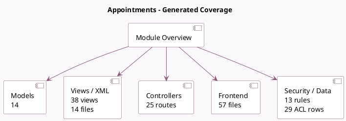

<!-- GENERATED:MODULE -->
---
tags: [odoo, enterprise, module]
---

# Appointments

- Scope: Enterprise Addons
- Source: enterprise/appointment
- Dependencies: [[docs/Community Addons/calendar/calendar|calendar]], [[docs/Community Addons/phone_validation/phone_validation|phone_validation]], [[docs/Community Addons/portal/portal|portal]], [[docs/Community Addons/resource/resource|resource]], [[docs/Enterprise Addons/web_gantt/web_gantt|web_gantt]]

## Summary

Allow people to book meetings in your agenda

## Generated coverage

- Models: 14
- XML files with UI/data artifacts: 14
- Views: 38
- Actions: 14
- Menus: 16
- Rules (ir.rule): 13
- Access CSV entries: 29
- Controller units: 5
- Frontend asset files: 57

## Module map

## Detail notes

- Models: [[docs/Enterprise Addons/appointment/Models|Models]] (14)
- Views and XML: [[docs/Enterprise Addons/appointment/Views|Views]] (14 files)
- Controllers: [[docs/Enterprise Addons/appointment/Controllers|Controllers]] (5)
- Frontend: [[docs/Enterprise Addons/appointment/Frontend|Frontend]] (57 files)

## Key models

- `appointment.answer`
- `appointment.answer.input`
- `appointment.booking.line`
- `appointment.invite`
- `appointment.manage.leaves`
- `appointment.question`
- `appointment.resource`
- `appointment.slot`
- `appointment.type`
- `calendar.alarm`
- `calendar.attendee`
- `calendar.event`

## Navigation

- [[../Enterprise Addons/Enterprise Addons|Back to scope]]
- [[../../docs/docs|Back to docs]]

<!-- GENERATED:MODULE -->

