<!-- GENERATED:MODEL -->
---
tags: [odoo, enterprise, generated, model]
---

# appointment.answer.input

- Module: [[docs/Enterprise Addons/appointment_account_payment/appointment_account_payment|appointment_account_payment]]
- Scope: Enterprise Addons
- Defined in module: extension only
- Source files: `models/appointment_answer_input.py`
- Python classes: `AppointmentAnswerInput`

## Field footprint

- Detected fields: 2
- Field types: `Many2one` x 2
- Relation fields: 2

## Sample fields

- `calendar_booking_id`: `Many2one` (comodel `calendar.booking`)
- `calendar_event_id`: `Many2one`

## Method hints

- Detected methods: 0
- Action methods: none
- Compute methods: none
- Onchange methods: none

## Direct relation diagram

```plantuml
@startuml
!define ODOO_COLOR_PRIMARY #714B67
!define ODOO_COLOR_ACCENT #875A7B
!define ODOO_COLOR_BG #FAF7FA

skinparam backgroundColor ODOO_COLOR_BG
skinparam defaultTextAlignment left
skinparam ArrowColor ODOO_COLOR_ACCENT
skinparam ClassBackgroundColor white
skinparam ClassBorderColor ODOO_COLOR_PRIMARY
skinparam ComponentBackgroundColor white
skinparam ComponentBorderColor ODOO_COLOR_PRIMARY
skinparam NoteBackgroundColor #FFF8FF
skinparam NoteBorderColor ODOO_COLOR_ACCENT
skinparam SequenceLifeLineBorderColor ODOO_COLOR_ACCENT
skinparam SequenceLifeLineBackgroundColor #FFFFFF
skinparam SequenceParticipantBorderColor ODOO_COLOR_PRIMARY
skinparam SequenceParticipantBackgroundColor #FFFFFF
skinparam sequence {
  ArrowColor ODOO_COLOR_ACCENT
  ActorBorderColor ODOO_COLOR_PRIMARY
}
title appointment.answer.input - Direct Relations
class "appointment.answer.input" as appointment_answer_input
class "calendar.booking" as calendar_booking
appointment_answer_input --> calendar_booking : calendar_booking_id
@enduml
```

## Navigation

- **Parent:** [[docs/Enterprise Addons/appointment_account_payment/Models]]

<!-- GENERATED:MODEL -->
