<!-- GENERATED:MODEL -->
---
tags: [odoo, enterprise, generated, model]
---

# appointment.type

- Module: [[docs/Enterprise Addons/appointment_account_payment/appointment_account_payment|appointment_account_payment]]
- Scope: Enterprise Addons
- Defined in module: extension only
- Source files: `models/appointment_type.py`, `models/templates/appointment_type.py`
- Python classes: `AppointmentType`

## Field footprint

- Detected fields: 4
- Field types: `Boolean` x 1, `Float` x 1, `Many2one` x 2
- Relation fields: 2

## Sample fields

- `has_payment_step`: `Boolean` (comodel `Up-front Payment`)
- `product_currency_id`: `Many2one` (related `product_id.currency_id`)
- `product_id`: `Many2one` (comodel `product.product`, compute `_compute_product_id`, store `True`)
- `product_lst_price`: `Float` (related `product_id.lst_price`)

## Method hints

- Detected methods: 6
- Action methods: none
- Compute methods: `_compute_product_id`
- Onchange methods: none

## Direct relation diagram

```plantuml
@startuml
!define ODOO_COLOR_PRIMARY #714B67
!define ODOO_COLOR_ACCENT #875A7B
!define ODOO_COLOR_BG #FAF7FA

skinparam backgroundColor ODOO_COLOR_BG
skinparam defaultTextAlignment left
skinparam ArrowColor ODOO_COLOR_ACCENT
skinparam ClassBackgroundColor white
skinparam ClassBorderColor ODOO_COLOR_PRIMARY
skinparam ComponentBackgroundColor white
skinparam ComponentBorderColor ODOO_COLOR_PRIMARY
skinparam NoteBackgroundColor #FFF8FF
skinparam NoteBorderColor ODOO_COLOR_ACCENT
skinparam SequenceLifeLineBorderColor ODOO_COLOR_ACCENT
skinparam SequenceLifeLineBackgroundColor #FFFFFF
skinparam SequenceParticipantBorderColor ODOO_COLOR_PRIMARY
skinparam SequenceParticipantBackgroundColor #FFFFFF
skinparam sequence {
  ArrowColor ODOO_COLOR_ACCENT
  ActorBorderColor ODOO_COLOR_PRIMARY
}
title appointment.type - Direct Relations
class "appointment.type" as appointment_type
class "product.product" as product_product
appointment_type --> product_product : product_id
@enduml
```

## Navigation

- **Parent:** [[docs/Enterprise Addons/appointment_account_payment/Models]]

<!-- GENERATED:MODEL -->
