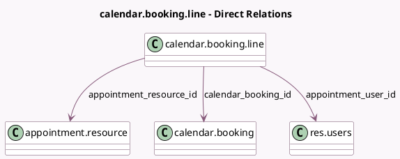

<!-- GENERATED:MODEL -->
---
tags: [odoo, enterprise, generated, model]
---

# calendar.booking.line

- Module: [[docs/Enterprise Addons/appointment_account_payment/appointment_account_payment|appointment_account_payment]]
- Scope: Enterprise Addons
- Defined in module: yes
- Source files: `models/calendar_booking_line.py`
- Python classes: `CalendarBookingLine`
- Description: Meeting User/Resource Booking

## Field footprint

- Detected fields: 5
- Field types: `Integer` x 2, `Many2one` x 3
- Relation fields: 3

## Sample fields

- `appointment_resource_id`: `Many2one` (comodel `appointment.resource`)
- `appointment_user_id`: `Many2one` (comodel `res.users`, related `calendar_booking_id.staff_user_id`)
- `calendar_booking_id`: `Many2one` (comodel `calendar.booking`)
- `capacity_reserved`: `Integer` (comodel `Capacity Reserved`)
- `capacity_used`: `Integer` (comodel `Capacity Used`)

## Method hints

- Detected methods: 0
- Action methods: none
- Compute methods: none
- Onchange methods: none

## Direct relation diagram

## Navigation

- **Parent:** [[docs/Enterprise Addons/appointment_account_payment/Models]]

<!-- GENERATED:MODEL -->
