<!-- GENERATED:MODEL -->
---
tags: [odoo, enterprise, generated, model]
---

# calendar.booking

- Module: [[docs/Enterprise Addons/appointment_account_payment/appointment_account_payment|appointment_account_payment]]
- Scope: Enterprise Addons
- Defined in module: yes
- Source files: `models/calendar_booking.py`
- Python classes: `CalendarBooking`
- Description: Meeting Booking

## Field footprint

- Detected fields: 19
- Field types: `Boolean` x 2, `Char` x 2, `Datetime` x 2, `Float` x 1, `Html` x 1, `Integer` x 1, `Many2many` x 1, `Many2one` x 7, `One2many` x 2
- Relation fields: 10

## Sample fields

- `account_move_id`: `Many2one` (comodel `account.move`)
- `allday`: `Boolean` (comodel `Allday`)
- `appointment_answer_input_ids`: `One2many` (comodel `appointment.answer.input`)
- `appointment_invite_id`: `Many2one` (comodel `appointment.invite`)
- `appointment_type_id`: `Many2one` (comodel `appointment.type`)
- `asked_capacity`: `Integer` (comodel `Asked Capacity`)
- `booking_line_ids`: `One2many` (comodel `calendar.booking.line`)
- `booking_token`: `Char` (comodel `Access Token`)
- `calendar_event_id`: `Many2one` (comodel `calendar.event`)
- `description`: `Html` (comodel `Description`)
- `duration`: `Float` (comodel `Duration`, compute `_compute_duration`)
- `guest_ids`: `Many2many` (comodel `res.partner`)
- `name`: `Char` (comodel `Customer Name`)
- `not_available`: `Boolean` (comodel `Is Not Available`)
- `partner_id`: `Many2one` (comodel `res.partner`)
- `product_id`: `Many2one` (comodel `product.product`)
- `staff_user_id`: `Many2one` (comodel `res.users`)
- `start`: `Datetime` (comodel `Start`)
- `stop`: `Datetime` (comodel `Stop`)

## Method hints

- Detected methods: 9
- Action methods: none
- Compute methods: `_compute_duration`
- Onchange methods: none

## Direct relation diagram

```plantuml
@startuml
!define ODOO_COLOR_PRIMARY #714B67
!define ODOO_COLOR_ACCENT #875A7B
!define ODOO_COLOR_BG #FAF7FA

skinparam backgroundColor ODOO_COLOR_BG
skinparam defaultTextAlignment left
skinparam ArrowColor ODOO_COLOR_ACCENT
skinparam ClassBackgroundColor white
skinparam ClassBorderColor ODOO_COLOR_PRIMARY
skinparam ComponentBackgroundColor white
skinparam ComponentBorderColor ODOO_COLOR_PRIMARY
skinparam NoteBackgroundColor #FFF8FF
skinparam NoteBorderColor ODOO_COLOR_ACCENT
skinparam SequenceLifeLineBorderColor ODOO_COLOR_ACCENT
skinparam SequenceLifeLineBackgroundColor #FFFFFF
skinparam SequenceParticipantBorderColor ODOO_COLOR_PRIMARY
skinparam SequenceParticipantBackgroundColor #FFFFFF
skinparam sequence {
  ArrowColor ODOO_COLOR_ACCENT
  ActorBorderColor ODOO_COLOR_PRIMARY
}
title calendar.booking - Direct Relations
class "calendar.booking" as calendar_booking
class "account.move" as account_move
class "appointment.answer.input" as appointment_answer_input
class "appointment.invite" as appointment_invite
class "appointment.type" as appointment_type
class "calendar.booking.line" as calendar_booking_line
class "calendar.event" as calendar_event
class "product.product" as product_product
class "res.partner" as res_partner
class "res.users" as res_users
calendar_booking --|> appointment_answer_input : appointment_answer_input_ids
calendar_booking --> appointment_invite : appointment_invite_id
calendar_booking --> appointment_type : appointment_type_id
calendar_booking .. res_partner : guest_ids
calendar_booking --> res_partner : partner_id
calendar_booking --|> calendar_booking_line : booking_line_ids
calendar_booking --> res_users : staff_user_id
calendar_booking --> account_move : account_move_id
calendar_booking --> product_product : product_id
calendar_booking --> calendar_event : calendar_event_id
@enduml
```

## Navigation

- **Parent:** [[docs/Enterprise Addons/appointment_account_payment/Models]]

<!-- GENERATED:MODEL -->
