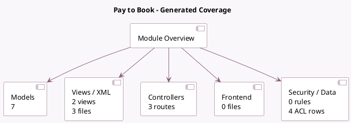

<!-- GENERATED:MODULE -->
---
tags: [odoo, enterprise, module]
---

# Pay to Book

- Scope: Enterprise Addons
- Source: enterprise/appointment_account_payment
- Dependencies: [[docs/Enterprise Addons/appointment/appointment|appointment]], [[docs/Community Addons/account_payment/account_payment|account_payment]]

## Summary

Up-front payment on bookings

## Generated coverage

- Models: 7
- XML files with UI/data artifacts: 3
- Views: 2
- Actions: 1
- Menus: 0
- Rules (ir.rule): 0
- Access CSV entries: 4
- Controller units: 2
- Frontend asset files: 0

## Module map

## Detail notes

- Models: [[docs/Enterprise Addons/appointment_account_payment/Models|Models]] (7)
- Views and XML: [[docs/Enterprise Addons/appointment_account_payment/Views|Views]] (3 files)
- Controllers: [[docs/Enterprise Addons/appointment_account_payment/Controllers|Controllers]] (2)

## Key models

- `account.move`
- `appointment.answer.input`
- `appointment.type`
- `calendar.booking`
- `calendar.booking.line`
- `product.product`
- `product.template`

## Navigation

- [[../Enterprise Addons/Enterprise Addons|Back to scope]]
- [[../../docs/docs|Back to docs]]

<!-- GENERATED:MODULE -->

