<!-- GENERATED:MODEL -->
---
tags: [odoo, enterprise, generated, model]
---

# appointment.type

- Module: [[docs/Enterprise Addons/appointment_crm/appointment_crm|appointment_crm]]
- Scope: Enterprise Addons
- Defined in module: extension only
- Source files: `models/appointment_type.py`
- Python classes: `AppointmentType`

## Field footprint

- Detected fields: 3
- Field types: `Boolean` x 1, `Integer` x 1, `Many2many` x 1
- Relation fields: 1

## Sample fields

- `lead_count`: `Integer` (comodel `Leads Count`, compute `_compute_lead_ids`)
- `lead_create`: `Boolean`
- `lead_ids`: `Many2many` (comodel `crm.lead`, compute `_compute_lead_ids`)

## Method hints

- Detected methods: 4
- Action methods: `action_appointment_leads`
- Compute methods: `_compute_lead_ids`
- Onchange methods: none

## Direct relation diagram

```plantuml
@startuml
!define ODOO_COLOR_PRIMARY #714B67
!define ODOO_COLOR_ACCENT #875A7B
!define ODOO_COLOR_BG #FAF7FA

skinparam backgroundColor ODOO_COLOR_BG
skinparam defaultTextAlignment left
skinparam ArrowColor ODOO_COLOR_ACCENT
skinparam ClassBackgroundColor white
skinparam ClassBorderColor ODOO_COLOR_PRIMARY
skinparam ComponentBackgroundColor white
skinparam ComponentBorderColor ODOO_COLOR_PRIMARY
skinparam NoteBackgroundColor #FFF8FF
skinparam NoteBorderColor ODOO_COLOR_ACCENT
skinparam SequenceLifeLineBorderColor ODOO_COLOR_ACCENT
skinparam SequenceLifeLineBackgroundColor #FFFFFF
skinparam SequenceParticipantBorderColor ODOO_COLOR_PRIMARY
skinparam SequenceParticipantBackgroundColor #FFFFFF
skinparam sequence {
  ArrowColor ODOO_COLOR_ACCENT
  ActorBorderColor ODOO_COLOR_PRIMARY
}
title appointment.type - Direct Relations
class "appointment.type" as appointment_type
class "crm.lead" as crm_lead
appointment_type .. crm_lead : lead_ids
@enduml
```

## Navigation

- **Parent:** [[docs/Enterprise Addons/appointment_crm/Models]]

<!-- GENERATED:MODEL -->
