<!-- GENERATED:MODEL -->
---
tags: [odoo, enterprise, generated, model]
---

# appointment.type

- Module: [[docs/Enterprise Addons/appointment_google_reserve/appointment_google_reserve|appointment_google_reserve]]
- Scope: Enterprise Addons
- Defined in module: extension only
- Source files: `models/appointment_type.py`
- Python classes: `AppointmentType`

## Field footprint

- Detected fields: 5
- Field types: `Boolean` x 3, `Char` x 1, `Many2one` x 1
- Relation fields: 1

## Sample fields

- `google_reserve_access_token`: `Char` (comodel `Google Reserve Access Token`)
- `google_reserve_enable`: `Boolean` (comodel `Enable Google Booking`)
- `google_reserve_merchant_id`: `Many2one` (comodel `google.reserve.merchant`)
- `google_reserve_pending_sync`: `Boolean` (comodel `Google Booking Pending Synchronization`)
- `is_auto_assign`: `Boolean` (compute `_compute_is_auto_assign`, store `True`)

## Method hints

- Detected methods: 11
- Action methods: `action_google_reserve_disable`, `action_google_reserve_enable`
- Compute methods: `_compute_is_auto_assign`
- Onchange methods: none

## Direct relation diagram

```plantuml
@startuml
!define ODOO_COLOR_PRIMARY #714B67
!define ODOO_COLOR_ACCENT #875A7B
!define ODOO_COLOR_BG #FAF7FA

skinparam backgroundColor ODOO_COLOR_BG
skinparam defaultTextAlignment left
skinparam ArrowColor ODOO_COLOR_ACCENT
skinparam ClassBackgroundColor white
skinparam ClassBorderColor ODOO_COLOR_PRIMARY
skinparam ComponentBackgroundColor white
skinparam ComponentBorderColor ODOO_COLOR_PRIMARY
skinparam NoteBackgroundColor #FFF8FF
skinparam NoteBorderColor ODOO_COLOR_ACCENT
skinparam SequenceLifeLineBorderColor ODOO_COLOR_ACCENT
skinparam SequenceLifeLineBackgroundColor #FFFFFF
skinparam SequenceParticipantBorderColor ODOO_COLOR_PRIMARY
skinparam SequenceParticipantBackgroundColor #FFFFFF
skinparam sequence {
  ArrowColor ODOO_COLOR_ACCENT
  ActorBorderColor ODOO_COLOR_PRIMARY
}
title appointment.type - Direct Relations
class "appointment.type" as appointment_type
class "google.reserve.merchant" as google_reserve_merchant
appointment_type --> google_reserve_merchant : google_reserve_merchant_id
@enduml
```

## Navigation

- **Parent:** [[docs/Enterprise Addons/appointment_google_reserve/Models]]

<!-- GENERATED:MODEL -->
