<!-- GENERATED:MODEL -->
---
tags: [odoo, enterprise, generated, model]
---

# google.reserve.merchant

- Module: [[docs/Enterprise Addons/appointment_google_reserve/appointment_google_reserve|appointment_google_reserve]]
- Scope: Enterprise Addons
- Defined in module: yes
- Source files: `models/google_reserve_merchant.py`
- Python classes: `GoogleReserveMerchant`
- Description: Google Reserve Merchant
- Inherits: `mail.thread.phone`

## Field footprint

- Detected fields: 6
- Field types: `Char` x 4, `Many2one` x 1, `One2many` x 1
- Relation fields: 2

## Sample fields

- `appointment_type_ids`: `One2many` (comodel `appointment.type`)
- `business_category`: `Char` (comodel `Business Category`)
- `location_id`: `Many2one` (comodel `res.partner`)
- `name`: `Char` (comodel `Merchant Name`)
- `phone`: `Char` (comodel `Phone`)
- `website_url`: `Char` (comodel `Website URL`)

## Method hints

- Detected methods: 5
- Action methods: none
- Compute methods: none
- Onchange methods: none

## Direct relation diagram

```plantuml
@startuml
!define ODOO_COLOR_PRIMARY #714B67
!define ODOO_COLOR_ACCENT #875A7B
!define ODOO_COLOR_BG #FAF7FA

skinparam backgroundColor ODOO_COLOR_BG
skinparam defaultTextAlignment left
skinparam ArrowColor ODOO_COLOR_ACCENT
skinparam ClassBackgroundColor white
skinparam ClassBorderColor ODOO_COLOR_PRIMARY
skinparam ComponentBackgroundColor white
skinparam ComponentBorderColor ODOO_COLOR_PRIMARY
skinparam NoteBackgroundColor #FFF8FF
skinparam NoteBorderColor ODOO_COLOR_ACCENT
skinparam SequenceLifeLineBorderColor ODOO_COLOR_ACCENT
skinparam SequenceLifeLineBackgroundColor #FFFFFF
skinparam SequenceParticipantBorderColor ODOO_COLOR_PRIMARY
skinparam SequenceParticipantBackgroundColor #FFFFFF
skinparam sequence {
  ArrowColor ODOO_COLOR_ACCENT
  ActorBorderColor ODOO_COLOR_PRIMARY
}
title google.reserve.merchant - Direct Relations
class "google.reserve.merchant" as google_reserve_merchant
class "appointment.type" as appointment_type
class "res.partner" as res_partner
google_reserve_merchant --|> appointment_type : appointment_type_ids
google_reserve_merchant --> res_partner : location_id
@enduml
```

## Navigation

- **Parent:** [[docs/Enterprise Addons/appointment_google_reserve/Models]]

<!-- GENERATED:MODEL -->
