<!-- GENERATED:MODEL -->
---
tags: [odoo, enterprise, generated, model]
---

# approval.approver

- Module: [[docs/Enterprise Addons/approvals/approvals|approvals]]
- Scope: Enterprise Addons
- Defined in module: yes
- Source files: `models/approval_approver.py`
- Python classes: `ApprovalApprover`
- Description: Approver

## Field footprint

- Detected fields: 10
- Field types: `Boolean` x 4, `Integer` x 1, `Many2many` x 1, `Many2one` x 3, `Selection` x 1
- Relation fields: 4

## Sample fields

- `can_edit`: `Boolean` (compute `_compute_can_edit`)
- `can_edit_user_id`: `Boolean` (compute `_compute_can_edit`)
- `category_approver`: `Boolean` (compute `_compute_category_approver`)
- `company_id`: `Many2one` (related `request_id.company_id`, store `True`)
- `existing_request_user_ids`: `Many2many` (comodel `res.users`, compute `_compute_existing_request_user_ids`)
- `request_id`: `Many2one` (comodel `approval.request`)
- `required`: `Boolean`
- `sequence`: `Integer` (comodel `Sequence`)
- `status`: `Selection`
- `user_id`: `Many2one` (comodel `res.users`)

## Method hints

- Detected methods: 7
- Action methods: `action_approve`, `action_refuse`
- Compute methods: `_compute_can_edit`, `_compute_category_approver`, `_compute_existing_request_user_ids`
- Onchange methods: none

## Direct relation diagram

```plantuml
@startuml
!define ODOO_COLOR_PRIMARY #714B67
!define ODOO_COLOR_ACCENT #875A7B
!define ODOO_COLOR_BG #FAF7FA

skinparam backgroundColor ODOO_COLOR_BG
skinparam defaultTextAlignment left
skinparam ArrowColor ODOO_COLOR_ACCENT
skinparam ClassBackgroundColor white
skinparam ClassBorderColor ODOO_COLOR_PRIMARY
skinparam ComponentBackgroundColor white
skinparam ComponentBorderColor ODOO_COLOR_PRIMARY
skinparam NoteBackgroundColor #FFF8FF
skinparam NoteBorderColor ODOO_COLOR_ACCENT
skinparam SequenceLifeLineBorderColor ODOO_COLOR_ACCENT
skinparam SequenceLifeLineBackgroundColor #FFFFFF
skinparam SequenceParticipantBorderColor ODOO_COLOR_PRIMARY
skinparam SequenceParticipantBackgroundColor #FFFFFF
skinparam sequence {
  ArrowColor ODOO_COLOR_ACCENT
  ActorBorderColor ODOO_COLOR_PRIMARY
}
title approval.approver - Direct Relations
class "approval.approver" as approval_approver
class "approval.request" as approval_request
class "res.users" as res_users
approval_approver --> res_users : user_id
approval_approver .. res_users : existing_request_user_ids
approval_approver --> approval_request : request_id
@enduml
```

## Navigation

- **Parent:** [[docs/Enterprise Addons/approvals/Models]]

<!-- GENERATED:MODEL -->
