<!-- GENERATED:MODEL -->
---
tags: [odoo, enterprise, generated, model]
---

# approval.category.approver

- Module: [[docs/Enterprise Addons/approvals/approvals|approvals]]
- Scope: Enterprise Addons
- Defined in module: yes
- Source files: `models/approval_category_approver.py`
- Python classes: `ApprovalCategoryApprover`
- Description: Approval Category Approver

## Field footprint

- Detected fields: 6
- Field types: `Boolean` x 1, `Integer` x 1, `Many2many` x 1, `Many2one` x 3
- Relation fields: 4

## Sample fields

- `category_id`: `Many2one` (comodel `approval.category`)
- `company_id`: `Many2one` (comodel `res.company`, related `category_id.company_id`)
- `existing_user_ids`: `Many2many` (comodel `res.users`, compute `_compute_existing_user_ids`)
- `required`: `Boolean`
- `sequence`: `Integer` (comodel `Sequence`)
- `user_id`: `Many2one` (comodel `res.users`)

## Method hints

- Detected methods: 1
- Action methods: none
- Compute methods: `_compute_existing_user_ids`
- Onchange methods: none

## Direct relation diagram

```plantuml
@startuml
!define ODOO_COLOR_PRIMARY #714B67
!define ODOO_COLOR_ACCENT #875A7B
!define ODOO_COLOR_BG #FAF7FA

skinparam backgroundColor ODOO_COLOR_BG
skinparam defaultTextAlignment left
skinparam ArrowColor ODOO_COLOR_ACCENT
skinparam ClassBackgroundColor white
skinparam ClassBorderColor ODOO_COLOR_PRIMARY
skinparam ComponentBackgroundColor white
skinparam ComponentBorderColor ODOO_COLOR_PRIMARY
skinparam NoteBackgroundColor #FFF8FF
skinparam NoteBorderColor ODOO_COLOR_ACCENT
skinparam SequenceLifeLineBorderColor ODOO_COLOR_ACCENT
skinparam SequenceLifeLineBackgroundColor #FFFFFF
skinparam SequenceParticipantBorderColor ODOO_COLOR_PRIMARY
skinparam SequenceParticipantBackgroundColor #FFFFFF
skinparam sequence {
  ArrowColor ODOO_COLOR_ACCENT
  ActorBorderColor ODOO_COLOR_PRIMARY
}
title approval.category.approver - Direct Relations
class "approval.category.approver" as approval_category_approver
class "approval.category" as approval_category
class "res.company" as res_company
class "res.users" as res_users
approval_category_approver --> approval_category : category_id
approval_category_approver --> res_company : company_id
approval_category_approver --> res_users : user_id
approval_category_approver .. res_users : existing_user_ids
@enduml
```

## Navigation

- **Parent:** [[docs/Enterprise Addons/approvals/Models]]

<!-- GENERATED:MODEL -->
