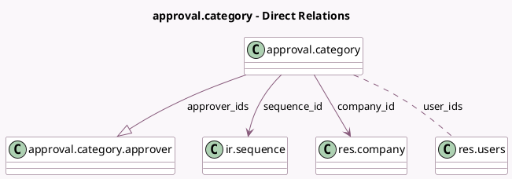

<!-- GENERATED:MODEL -->
---
tags: [odoo, enterprise, generated, model]
---

# approval.category

- Module: [[docs/Enterprise Addons/approvals/approvals|approvals]]
- Scope: Enterprise Addons
- Defined in module: yes
- Source files: `models/approval_category.py`
- Python classes: `ApprovalCategory`
- Description: Approval Category

## Field footprint

- Detected fields: 29
- Field types: `Binary` x 1, `Boolean` x 4, `Char` x 4, `Integer` x 3, `Many2many` x 1, `Many2one` x 2, `One2many` x 1, `PropertiesDefinition` x 1, `Selection` x 12
- Relation fields: 4

## Sample fields

- `active`: `Boolean`
- `approval_minimum`: `Integer`
- `approval_properties_definition`: `PropertiesDefinition` (comodel `Approval Properties`)
- `approval_type`: `Selection`
- `approver_ids`: `One2many` (comodel `approval.category.approver`)
- `approver_sequence`: `Boolean` (comodel `Approvers Sequence?`)
- `automated_sequence`: `Boolean` (comodel `Automated Sequence?`)
- `company_id`: `Many2one` (comodel `res.company`)
- `description`: `Char`
- `has_amount`: `Selection`
- `has_date`: `Selection`
- `has_location`: `Selection`
- `has_partner`: `Selection`
- `has_payment_method`: `Selection`
- `has_period`: `Selection`
- `has_product`: `Selection`
- `has_quantity`: `Selection`
- `has_reference`: `Selection`
- `image`: `Binary`
- `invalid_minimum`: `Boolean` (compute `_compute_invalid_minimum`)

## Method hints

- Detected methods: 10
- Action methods: none
- Compute methods: `_compute_invalid_minimum`, `_compute_request_to_validate_count`, `_compute_user_ids`
- Onchange methods: none

## Direct relation diagram

## Navigation

- **Parent:** [[docs/Enterprise Addons/approvals/Models]]

<!-- GENERATED:MODEL -->
