<!-- GENERATED:MODEL -->
---
tags: [odoo, enterprise, generated, model]
---

# approval.product.line

- Module: [[docs/Enterprise Addons/approvals/approvals|approvals]]
- Scope: Enterprise Addons
- Defined in module: yes
- Source files: `models/approval_product_line.py`
- Python classes: `ApprovalProductLine`
- Description: Product Line

## Field footprint

- Detected fields: 6
- Field types: `Char` x 1, `Float` x 1, `Many2one` x 4
- Relation fields: 4

## Sample fields

- `approval_request_id`: `Many2one` (comodel `approval.request`)
- `company_id`: `Many2one` (related `approval_request_id.company_id`, store `True`)
- `description`: `Char` (comodel `Description`, compute `_compute_description`, store `True`)
- `product_id`: `Many2one` (comodel `product.product`)
- `product_uom_id`: `Many2one` (comodel `uom.uom`, compute `_compute_product_uom_id`, store `True`)
- `quantity`: `Float` (comodel `Quantity`)

## Method hints

- Detected methods: 2
- Action methods: none
- Compute methods: `_compute_description`, `_compute_product_uom_id`
- Onchange methods: none

## Direct relation diagram

```plantuml
@startuml
!define ODOO_COLOR_PRIMARY #714B67
!define ODOO_COLOR_ACCENT #875A7B
!define ODOO_COLOR_BG #FAF7FA

skinparam backgroundColor ODOO_COLOR_BG
skinparam defaultTextAlignment left
skinparam ArrowColor ODOO_COLOR_ACCENT
skinparam ClassBackgroundColor white
skinparam ClassBorderColor ODOO_COLOR_PRIMARY
skinparam ComponentBackgroundColor white
skinparam ComponentBorderColor ODOO_COLOR_PRIMARY
skinparam NoteBackgroundColor #FFF8FF
skinparam NoteBorderColor ODOO_COLOR_ACCENT
skinparam SequenceLifeLineBorderColor ODOO_COLOR_ACCENT
skinparam SequenceLifeLineBackgroundColor #FFFFFF
skinparam SequenceParticipantBorderColor ODOO_COLOR_PRIMARY
skinparam SequenceParticipantBackgroundColor #FFFFFF
skinparam sequence {
  ArrowColor ODOO_COLOR_ACCENT
  ActorBorderColor ODOO_COLOR_PRIMARY
}
title approval.product.line - Direct Relations
class "approval.product.line" as approval_product_line
class "approval.request" as approval_request
class "product.product" as product_product
class "uom.uom" as uom_uom
approval_product_line --> approval_request : approval_request_id
approval_product_line --> product_product : product_id
approval_product_line --> uom_uom : product_uom_id
@enduml
```

## Navigation

- **Parent:** [[docs/Enterprise Addons/approvals/Models]]

<!-- GENERATED:MODEL -->
