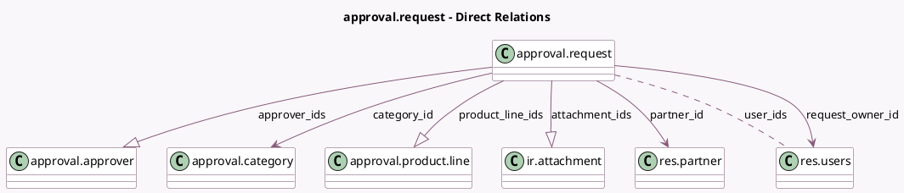

<!-- GENERATED:MODEL -->
---
tags: [odoo, enterprise, generated, model]
---

# approval.request

- Module: [[docs/Enterprise Addons/approvals/approvals|approvals]]
- Scope: Enterprise Addons
- Defined in module: yes
- Source files: `models/approval_request.py`
- Python classes: `ApprovalRequest`
- Description: Approval Request
- Inherits: `mail.activity.mixin`, `mail.thread.main.attachment`

## Field footprint

- Detected fields: 40
- Field types: `Binary` x 1, `Boolean` x 5, `Char` x 3, `Datetime` x 4, `Float` x 2, `Html` x 1, `Integer` x 2, `Many2many` x 1, `Many2one` x 4, `One2many` x 3, `Properties` x 1, `Selection` x 13
- Relation fields: 8

## Sample fields

- `active`: `Boolean`
- `amount`: `Float`
- `approval_minimum`: `Integer` (related `category_id.approval_minimum`)
- `approval_properties`: `Properties` (comodel `Properties`)
- `approval_type`: `Selection` (related `category_id.approval_type`)
- `approver_ids`: `One2many` (comodel `approval.approver`, compute `_compute_approver_ids`, store `True`)
- `approver_sequence`: `Boolean` (related `category_id.approver_sequence`)
- `attachment_ids`: `One2many` (comodel `ir.attachment`)
- `attachment_number`: `Integer` (comodel `Number of Attachments`, compute `_compute_attachment_number`)
- `automated_sequence`: `Boolean` (related `category_id.automated_sequence`)
- `category_id`: `Many2one` (comodel `approval.category`)
- `category_image`: `Binary` (related `category_id.image`)
- `change_request_owner`: `Boolean` (compute `_compute_has_access_to_request`)
- `company_id`: `Many2one` (related `category_id.company_id`, store `True`)
- `date`: `Datetime`
- `date_confirmed`: `Datetime`
- `date_end`: `Datetime`
- `date_start`: `Datetime`
- `has_access_to_request`: `Boolean` (compute `_compute_has_access_to_request`)
- `has_amount`: `Selection` (related `category_id.has_amount`)

## Method hints

- Detected methods: 26
- Action methods: `action_approve`, `action_cancel`, `action_confirm`, `action_draft`, `action_get_attachment_view`, `action_refuse`, `action_withdraw`
- Compute methods: `_compute_approver_ids`, `_compute_attachment_number`, `_compute_has_access_to_request`, `_compute_request_status`, `_compute_user_ids`, `_compute_user_status`
- Onchange methods: none

## Direct relation diagram

## Navigation

- **Parent:** [[docs/Enterprise Addons/approvals/Models]]

<!-- GENERATED:MODEL -->
