<!-- GENERATED:MODEL -->
---
tags: [odoo, enterprise, generated, model]
---

# mail.activity

- Module: [[docs/Enterprise Addons/approvals/approvals|approvals]]
- Scope: Enterprise Addons
- Defined in module: extension only
- Source files: `models/mail_activity.py`
- Python classes: `MailActivity`

## Field footprint

- Detected fields: 2
- Field types: `Many2one` x 2
- Relation fields: 2

## Sample fields

- `approval_request_id`: `Many2one` (comodel `approval.request`, compute `_compute_approval_request_id`)
- `approver_id`: `Many2one` (comodel `approval.approver`, compute `_compute_approver_id`)

## Method hints

- Detected methods: 4
- Action methods: none
- Compute methods: `_compute_approval_request_id`, `_compute_approver_id`
- Onchange methods: none

## Direct relation diagram

```plantuml
@startuml
!define ODOO_COLOR_PRIMARY #714B67
!define ODOO_COLOR_ACCENT #875A7B
!define ODOO_COLOR_BG #FAF7FA

skinparam backgroundColor ODOO_COLOR_BG
skinparam defaultTextAlignment left
skinparam ArrowColor ODOO_COLOR_ACCENT
skinparam ClassBackgroundColor white
skinparam ClassBorderColor ODOO_COLOR_PRIMARY
skinparam ComponentBackgroundColor white
skinparam ComponentBorderColor ODOO_COLOR_PRIMARY
skinparam NoteBackgroundColor #FFF8FF
skinparam NoteBorderColor ODOO_COLOR_ACCENT
skinparam SequenceLifeLineBorderColor ODOO_COLOR_ACCENT
skinparam SequenceLifeLineBackgroundColor #FFFFFF
skinparam SequenceParticipantBorderColor ODOO_COLOR_PRIMARY
skinparam SequenceParticipantBackgroundColor #FFFFFF
skinparam sequence {
  ArrowColor ODOO_COLOR_ACCENT
  ActorBorderColor ODOO_COLOR_PRIMARY
}
title mail.activity - Direct Relations
class "mail.activity" as mail_activity
class "approval.approver" as approval_approver
class "approval.request" as approval_request
mail_activity --> approval_request : approval_request_id
mail_activity --> approval_approver : approver_id
@enduml
```

## Navigation

- **Parent:** [[docs/Enterprise Addons/approvals/Models]]

<!-- GENERATED:MODEL -->
