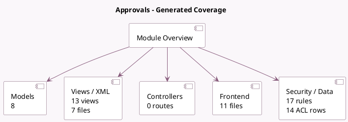

<!-- GENERATED:MODULE -->
---
tags: [odoo, enterprise, module]
---

# Approvals

- Scope: Enterprise Addons
- Source: enterprise/approvals
- Dependencies: [[docs/Community Addons/mail/mail|mail]], [[docs/Community Addons/hr/hr|hr]], [[docs/Community Addons/product/product|product]]

## Summary

Create and validate approvals requests

## Generated coverage

- Models: 8
- XML files with UI/data artifacts: 7
- Views: 13
- Actions: 11
- Menus: 12
- Rules (ir.rule): 17
- Access CSV entries: 14
- Controller units: 0
- Frontend asset files: 11

## Module map

## Detail notes

- Models: [[docs/Enterprise Addons/approvals/Models|Models]] (8)
- Views and XML: [[docs/Enterprise Addons/approvals/Views|Views]] (7 files)
- Frontend: [[docs/Enterprise Addons/approvals/Frontend|Frontend]] (11 files)

## Key models

- `approval.approver`
- `approval.category`
- `approval.category.approver`
- `approval.product.line`
- `approval.request`
- `ir.attachment`
- `mail.activity`
- `mail.activity.type`

## Navigation

- [[../Enterprise Addons/Enterprise Addons|Back to scope]]
- [[../../docs/docs|Back to docs]]

<!-- GENERATED:MODULE -->

